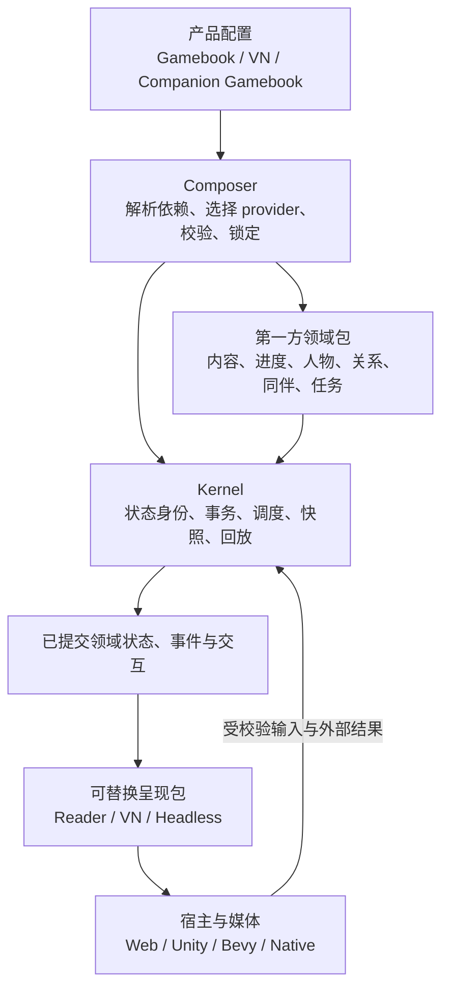

# Narrata：类型化叙事节点与可组合能力的重建提案

日期：2026-09-05。状态：提案，尚未实施。
调查基线：`95e7af90af75d13efedf08deb009014d15a16453`。

本轮修订依据见 [真实实现与学术研究](docs/research/2026-09-05-narrative-model-evidence.md)：
Scene 成为统一节点族中的一种类型，SceneState 由其运行实例产生；标签机制仍待验证。
产品顺序明确为 Web Gamebook → VN → 更复杂任务/同伴/世界叙事，不以制造差异为设计目标。

本提案根据用户的新约束重新确定下一步，取代“直接进入 Stage 6 作者工作台”的优先级建议。已有 Stage 1–5 是可复用实现与验证材料，不预设其中的公共抽象就是最终模型。实施前应将本提案收敛为少量 ADR、package 契约和可执行样例，避免长期维护另一份与实现并行的总规范。

## 1. 产品定位与核心决策

**Narrata 是可组合的叙事引擎：通过有明确状态、行为和协作契约的能力包，构建 Gamebook、VN、任务、同伴、社会关系以及其他叙事驱动体验。**

它包含一个可靠执行的 kernel，也包含第一方叙事领域能力。完整同伴体系属于 Narrata 的产品范围；Gamebook、对白和同伴规则都能成为可选择的能力，不要求所有作品安装同一组模块。

推荐的语义基础是 **类型化、可组合的叙事定义图＋共享领域状态＋活动实例执行**。
Skyrim/BG3 级叙事是长期表达能力目标，第一阶段交付可使用的交互网页。复杂目标用于检验
角色绑定、长期状态、乱序完成与活动中断等扩展路径，不要求第一阶段完整实现 AAA 叙事系统。

初始架构采用：

```text
可组合叙事能力包 + 作品规则/内容包 + 产品装配配置
                       ↓
             校验、接线、锁定、构建
                       ↓
         统一会话状态与确定性动作执行
                       ↓
       内容/行动/事件/展示投影/宿主效果
                       ↓
       Gamebook Reader / VN / 游戏宿主
```

这里的“通用”通过多个第一方产品组合验证。不会把 VN SceneState 改名成 WorldState，然后继续要求所有体验执行一个对白入口；也不会只提供一个任意事件总线，让使用者自己补完全部叙事能力。

## 2. 本次学习得到的依据

最新一轮额外核查了 BG3 官方 Osiris、Anubis、Journal 与同伴 API；Mutagen 的 Skyrim
Scene/Quest/StoryManager 格式实现；LSLib 编译 IR；Anansi 的 Storylet/Instance；以及
Storylets、Façade、Versu 和意图驱动叙事规划论文。固定源码版本、实际观察与适用边界集中记录在
[研究依据](docs/research/2026-09-05-narrative-model-evidence.md)。下表是此前的组合架构参考。

| 来源 | 学到的原则 | 在 Narrata 中的应用 |
| --- | --- | --- |
| [Lattice Axiom 重建提案](../lattice-axiom/REBUILD_PROPOSAL.md) | package 是组合、版本、实现、数据和资源所有权单位；产品图与 Cargo 图分开；通过生成的入口装配 | Narrata package 也必须能够实际选择和替换实现；明确数据、状态与代码 owner |
| [Twee 3 规范](https://github.com/iftechfoundation/twine-specs/blob/master/twee-3-specification.md) | 交互文本以 passage 组织，内容单元不要求是对白 | Gamebook 使用内容节点与行动入口，不需要 Say/Advance 伪装层 |
| [Versu 架构论文](https://versu.com/wp-content/uploads/2014/05/versu.pdf) | 人物参与具有角色与可执行行动的情境；情境提供行动，人物决策机制选择行动 | 将 Situation、参与角色、Action 与选择策略分开；情境可复用且可并存 |
| [Ensemble](https://github.com/ensemble-engine/ensemble/wiki) | 社会世界、人物、意愿、行动和后果是可以独立建模的领域 | 同伴能力不简化为头像和好感度变量 |
| [Ensemble Schema](https://github.com/ensemble-engine/ensemble/wiki/Schema) | 关系可以有方向、对称规则与持续时间；状态与事件值得区分 | 关系、记忆与规则拥有明确 schema，不把所有状态压入无含义的全局变量 |
| [Unreal Game Features](https://dev.epicgames.com/documentation/en-us/unreal-engine/game-features-and-modular-gameplay-in-unreal-engine) | 独立能力封装实现和数据，减少偶然依赖 | 同伴套件是可装配的实际能力，通用 host 不写死具体同伴策略 |
| [WIT worlds](https://component-model.bytecodealliance.org/design/worlds.html) | 显式声明 imports/exports，再进行接线组合 | 使用可验证的端口和绑定；接口匹配与状态/行为兼容分开判断 |
| [SCXML](https://www.w3.org/TR/scxml/#AlgorithmforSCXMLInterpretation) | 完成当前输入引起的确定性内部处理，再接受下一个外部输入 | 保留可解释的动作边界，但具体活动不必全部建成 Statechart |

Versu/Ensemble 是历史架构参考，本次不据此宣称其当前维护情况，也不直接引入其代码。WIT 是组合边界参考，首版不强制使用 WebAssembly Component ABI。以上资料支持的是可取的设计原则；下文 package 名称、契约及执行协议属于 Narrata 提案。

Lattice 提案中的合仓、自主提交、Bevy/体素实现等授权与约束属于该项目，不转用于本次 Narrata 工作。本次仅编写方案。

## 3. 章节、情境、流程和画面应分开

没有适用于所有叙事形态的唯一“场景”粒度。建议明确以下概念：

| 概念 | 表示什么 | Gamebook 示例 | VN/同伴示例 |
| --- | --- | --- | --- |
| Chapter / Collection | 作者组织与发行分组 | 第三章：穿过山口 | 第一幕、个人剧情集 |
| Content Unit / Occurrence | 内容本身及一次编排出现 | 一篇正文及其在路线中的出现节点 | 台词、描述段、选项标签及其出现 |
| Passage / Progression Node | 进度位置与可用后续行动 | 营地页，返回营地仍是同一作者节点 | 某段剧情入口 |
| Situation | 有参与角色、上下文和行动规则的叙事情境 | 队伍在营地分配食物 | 邀请入队、争执、承诺、共同休息 |
| Activity | 一次执行中的过程，有自己的生命周期与局部状态 | 一次探索、谈判或节点访问过程 | 正在运行的对白、同伴任务 |
| Interaction / Action Offer | 当前向用户或控制器提供的输入机会 | 走山路、分配食物、请求帮助 | 回答、邀请、拒绝、继续对白 |
| Presentation State | 某种呈现方案的状态 | 正文阅读布局、附图 | 立绘、相机、音轨、转场 |

Chapter、Passage、Situation 之间不强制一对一。一章可以跨越很多情境；同一个营地情境可以覆盖数个内容节点；重新访问相同节点可以产生新的 Activity/Interaction occurrence。

Situation 也是可选领域能力。最简单的分支阅读器只需内容与进度节点，不应为了运行而创建空 Actor、空 Situation 或空 SceneState。

### 3.1 Gamebook 不需要对白流

一个建议模型如下，字段为概念示意：

```text
Chapter: mountain-pass
  Node: camp
    body: ContentOccurrence(rezics, structure, stable-node-id, revision-policy)
    on_enter: StartSituation(camp, participants)
    actions:
      - travel(mountain-path)
      - distribute-food(recipient)
      - ask-for-help(companion)
```

Reader 渲染正文和行动入口。玩家分配食物时，内容节点可以保持在 camp，而队伍资源、人物关系和下一轮行动发生变化。玩家走山路时，progression provider 才改变节点。这比将每种同伴状态展开成不同剧情边更适合组合能力。

输入仍然存在，但可以是选择路线、翻到下一内容节点、使用物品或请求同伴帮助；它不是对白的 `Advance`。滚动、阅读位置、字体大小通常是 Reader 状态。只有作品明确需要“读完后触发规则”时才产生对应语义输入。

如果作品完全没有状态或行动语义，内容展示本身也不必制造 Runtime Commit。Narrata 只处理被作品定义为有叙事意义的操作。

保留现有 [REZICS 所有权边界](docs/rezics-gamebook-integration.md)：REZICS 负责正文、内容 occurrence、权限与生命周期；Narrata 的 progression/content adapter 负责叙事行为与解析契约。文件系统、REZICS、静态内容包应能通过同一内容端口替换。替换 provider 不改变正文版权或访问权限的归属。

### 3.2 VN 是一个产品组合

VN 选择顺序流程、对白交互、角色内容映射、VN presentation 和媒体宿主。它可以把动作结果展开为连续台词；Gamebook 可以把同样的结果呈现为一段叙述；headless 测试只检查领域状态与事件。

跨呈现的一致性针对相同领域配置与领域动作。VN 的逐句 advance、动画结束和阅读器滚动不天然对应同一组领域动作，不能直接要求不同表现流程的每一个 Commit hash 都相同。

### 3.3 统一节点族，而不统一所有节点的执行方式

节点是作者与工具使用的有类型叙事单元。统一身份、引用、组合和版本契约，各类型定义自己的配置、状态及行为：

| 候选节点类型 | 类型语义 | 对应运行状态 |
| --- | --- | --- |
| ContentNode | 展示正文或内容引用 | 可按需记录已解析 revision、交互等 |
| DecisionNode | 提供经过条件校验的行动/选择 | 当前 offer、有效版本和等待信息 |
| SubgraphNode | 封装可复用子图，绑定参数、调用并返回 | 局部状态、子实例与返回位置 |
| SceneNode | 有角色、上下文与子过程的叙事场景 | SceneState：角色绑定、子活动进度、局部状态、等待与占用 |
| QuestNode | 跨事件持续存在的目标与结果规则 | QuestState：目标事实、进度、成功/失败等 |
| CharacterNode | 角色定义与持久身份，可以被其他节点引用 | CharacterState；不会因为被图引用就自动执行 |

这些名称是候选，不代表必须建立六种 Rust 继承类或让作者把每句话都拖成节点。
Gamebook 第一版只需要内容、选择和子图能力。Scene 可以作为复合节点的一种专门类型逐步形成。

```text
NodeType<K>
  声明配置 schema、合法端口、行为契约、可选状态 schema
        ↓
NodeDefinition<K>
  作品中的配置、引用、输入输出与内部结构
        ↓ 绑定参数 / 激活
NodeInstance<K>
  属于这次运行的 State<K>
```

因此 SceneState 是 Scene 类型实例的状态，不再是 Session 的必需特殊字段。
同一个 Scene 定义可以被不同角色多次实例化；它们的局部状态独立，而人物关系等共享事实通过引用访问。
无状态内容节点不需要空状态对象，人物数据节点也不需要伪造 next/return。

所谓“自然推导”是从明确的节点类型和组合规则构造状态；不依赖从任意正文或标签猜测类型。
作者模型可以被编译为不同局部执行 IR。节点图是语义与工具组织方式，不预设使用图数据库，
也不要求用一个解释器循环执行所有节点。

### 3.4 多套节点怎样接成一个作品

节点包导出少量入口、角色参数与结果；复合节点内部的结构保持局部封装。
组合配置把主线包、同伴内容包和环境事件包接起来：

- 固定顺序：一个结果明确进入另一个片段；
- 调用/返回：进入同伴互动，完成后回到原来的主线继续点；
- 条件选择：在机会点从适用节点实例中选择；
- 事件触发：事实变化激活后续反应或任务；
- 数据/角色绑定：把某个角色、地点或物品绑定到片段参数。

这些边有不同语义，不能共用一条含义不明的 next。结构装配检查类型和引用；运行时再次校验
条件、角色有效性与占用。共同协议允许接线，但不保证任意作者内容的文学衔接。

第一阶段用三个独立内容包验证固定连接与子图调用。动态候选选择作为后续扩展，不作为所有
内容都必须采用的叙事结构。

### 3.5 标签暂不作为基础假设

标签可以用于作者分类、检索或候选筛选，但具体机制仍待实验：开放字符串、注册标签、
分类层级和类型化属性有不同维护成本。人物状态、关系和承诺先由领域事实表达。

类型决定节点怎样被检查和执行；标签若被选择器读取，就成为影响运行的语义数据，应进入
相应构件身份；纯编辑器分类可留在 metadata。第一版可以没有参与执行的标签机制。

## 4. Kernel、叙事领域包、呈现与宿主



### 4.1 Kernel 的责任

- 模块/实体/动作/会话的身份及版本化注册；
- 受校验的命令、查询、事件和宿主效果边界；
- 明确的状态 owner、确定性调度与原子提交；
- 完整逻辑 Snapshot、历史、回放与迁移协调；
- 预算、因果链、诊断、存储 adapter 的公共协议。

Kernel 不需要把台词、立绘、好感度、任务节点逐个写进一个总枚举。它也不负责图形、碰撞和操作系统窗口。它必须支持注册后可检查的领域类型与处理器，而不以任意 payload 字典代替领域契约。

### 4.2 第一方领域包属于引擎

建议能力包括内容与引用、进度图、Flow、Statechart、人物、关系/社会状态、同伴、任务/承诺、内容选择与情境。它们由 Narrata 维护，拥有默认规则、数据格式、可运行样例和测试，也允许其他实现提供兼容端口。

这些是逻辑能力边界，不要求每项立刻独立建 crate。只有独立替换、分发或依赖需求成立时才拆 package。首个同伴样例可以将关系、记忆与意愿作为一个 social package 的内部模块，而把它与 companion lifecycle 的接口先固定下来。

对作者提供 Gamebook、VN、Companion Gamebook 等默认套件；高级使用者再更换 provider。模块化的复杂度主要由 composer 和第一方套件承担，不能把“从零组装十几个基础组件”当作普通作者的入门要求。

### 4.3 展示模型与宿主执行

SceneNode 可以承载有参与者与子过程的叙事场景，其状态按节点类型生成。现有二维 SceneState
中的图层、立绘、相机和音轨则拆为可选呈现节点/组件的状态，由场景按需组合。
因此本方案不再把未来的 SceneState 名称固定等同于 VN 显示快照。

Situation 是场景或其他活动的情境信息；具体是否独立为节点类型，还是作为可复用配置/组件，
通过样例决定。不能仅靠改名把现有相机模型变成通用叙事情境。

完整同伴体系可以拥有跟随意图、协作目标、战斗立场与援助决策。空间寻路、动画和物理执行由相应宿主/provider 完成，并将成功、失败、中断作为事件返回。Gamebook 可选抽象旅行/协作实现；3D 产品可选导航适配。领域上谁拥有位置、背包或战斗状态必须由产品明确选择，不能宿主与 Narrata 双写同一事实。

## 5. Package 是真正的组合单位

借鉴 [Lattice 提案第 4 节](../lattice-axiom/REBUILD_PROPOSAL.md)，区分三张图：package 依赖/端口绑定图、执行时因果/调度图、作者剧情/内容图。Cargo graph 只处理 Rust 构建依赖，不能替代其中任意一张。

[Cargo features 会合并且通常应为 additive](https://doc.rust-lang.org/cargo/reference/features.html)。因此“开一个 companion feature”可以是构建结果，不能承担全部 provider 选择与冲突求解语义。

### 5.1 建议 manifest 契约

每个 package 至少声明：

| 组成 | 需要明确的事实 |
| --- | --- |
| 身份与依赖 | package ID、精确来源、版本约束、依赖实例、目标兼容范围 |
| 提供与需求 | typed exports/imports、作用域、provider 数量、查询/命令/事件类别 |
| 状态所有权 | namespaces、schema 版本、初始状态构造、codec、迁移入口 |
| 实现 | 数据/规则、原生代码、可移植实现的入口及真实构建输入 |
| 协作 | 可读端口、可发命令、订阅事件、执行阶段和所需顺序 |
| 内容/资源 | 内容 schema、逻辑资源引用、可选显示绑定、构建闭包 |
| 验证与工具 | conformance fixtures、诊断与 inspector 描述、可选编辑器扩展 |

代码包内部可以有多个 crates；数据包和聚合包不创建空 crate。一个实现或权威状态只有一个 owner。manifest 应是机器检查的事实来源，不再手工维护同样内容的另一张参考表。

### 5.2 具体如何替换

端口表达消费者需要的语义，而不暴露 provider 的内部状态。例如，同伴不必要求所有关系系统提供 `get_friendship_number()`，可以要求：

```text
social.observe(event)                         记录一项有来源的社会事实
cooperation.assess(actor, request, context)    判断是否愿意协作并给出可解释依据
party.request_join(actor, party)              请求加入队伍
content.resolve(occurrence, context)          解析可展示内容
```

这是端口草案，命令、只读查询及异步外部调用需要在真实 schema 中分别定义。

一个作品选择“单轴好感规则”，另一个选择“信任、尊重与立场规则”。它们可以提供相同 cooperation 契约，产生不同但合法的行为；不能要求不同玩法策略在所有输入上给出相同结果。契约测试验证共同保证，产品测试验证所选玩法。

provider 选择必须显式：某端口恰好一个实现；允许多个贡献者的端口必须声明合并/排序规则。不能靠注册顺序或“最后加载的插件获胜”。作用域内多余 provider、缺失 provider、重复 ID、不满足版本/目标和禁止的依赖环均在 compose 时失败。

产品装配可采用如下文本形式，语法与字段仅为示意，尚无对应 parser：

```toml
[product]
id = "example/companion-gamebook"
entry = "journey.start"

[instances]
journey = "narrata/progression"
content = "example/camp-content"
cast = "narrata/actors"
companions = "narrata/companions"
social = "example/social-simple"
supplies = "example/camp-supplies"
view = "narrata/reader-text"

[bindings]
"journey.content" = "content.resolve"
"journey.companions" = "companions.actions"
"companions.actors" = "cast.query"
"companions.cooperation" = "social.cooperation"
"companions.observe_social" = "social.observe"
"companions.supplies" = "supplies.commands"
"view.progression" = "journey.read"
"view.companions" = "companions.read"
```

将 social 换为 `example/social-multiaxis` 后，bindings 可以不变；其他端口通过 package manifest 的依赖补齐，composer 校验完整闭包，生成精确来源/版本锁。该示例的食物权威状态由 camp-supplies 拥有，UI 和 social 不各自维护一份食物数量。

包依赖图要求可解析；运行时人物间事件往返不等于 package 依赖环。通过稳定契约和 product bindings 解开相互依赖，运行时仍设置事件预算和明确反馈规则。

### 5.3 先采用哪种实现方式

第一轮采用本地 manifest、显式 provider 绑定、静态生成产品入口以及同一组原生/Wasm 实现。作者内容与规则先使用受限制、可检查的数据表达。无需先实现包市场、任意 native DLL 热加载或通用远程版本求解器。

几种备选路线的取舍如下：

| 路线 | 好处 | 不作为主方案的原因 |
| --- | --- | --- |
| 持续扩充一个 VN/Flow 总模型 | 最大化复用现有实现 | 非对白能力容易被迫制造假 continuation/场景，替换范围仍受总模型约束 |
| 所有行为都放入一个 Statechart | 执行语义较统一 | 关系、内容、人物记忆与选择策略被迫展开成控制状态，作者负担偏大 |
| 只有 ECS/事件总线/插件接口 | 实现自由度高 | 不能自动提供叙事模型、跨包事务、存档和作者工作流；ECS 可作为某个 provider 的内部实现 |
| Kernel + 第一方领域包 + 显式产品装配 | 不同叙事形态可独立运行，同时共享状态与工具契约 | 需要认真建设 composition、ownership 和兼容性，故用多个小型产品先验证 |

这仍是真正的可替换：修改产品配置并重新构建，就应改变所选代码、规则、状态注册项和资源，不改 kernel 或消费方源码。替换不必须意味着运行中卸载。

[WIT 的 imports/exports 组合](https://component-model.bytecodealliance.org/design/worlds.html)适合作为将来跨语言组件的边界参考，但接口兼容不证明行为相同、可确定性执行或旧状态可迁移。原生模块属于受信实现；仅写 manifest 不能阻止任意原生代码读取时钟或网络。受限规则执行器、测试与将来的隔离实现分别承担相应保证。

## 6. 同伴体系如何由能力组成

“完整”在此指有连贯领域生命周期及扩展接口，而不是本次就实现所有 RPG 战斗、寻路和自然语言能力。建议覆盖：

| 能力 | 领域模型与行为 |
| --- | --- |
| 人物与角色 | 持久人物身份、特征、可参与身份；与 portrait/ActorState 分开 |
| 队伍与可用性 | 认识、招募、入队、离队、暂离、再加入；容量、职责与选择约束 |
| 关系 | 有方向的信任/好感等维度、对称关系、立场及变化来源 |
| 记忆/知识 | 经历、获知渠道、对谁的看法；世界事实与人物认知分开 |
| 目标与承诺 | 当前目标、个人任务、承诺的履行与违背、协作条件 |
| 行动策略 | 为候选行动评分/筛选；服从、拒绝、建议、主动援助或离开 |
| 剧情反应 | 触发个人剧情、插话、日记、叙述段或通知；不强制启动对白 |
| 宿主能力 | 可选旅行、战斗援助、物品与空间执行接口，返回明确结果 |

关系不是必需固定为好感数值。Ensemble 的 schema 展示了不同方向与时间语义的社会状态；Narrata 的作品包可以选择自己的维度和规则。[Ensemble Schema](https://github.com/ensemble-engine/ensemble/wiki/Schema)

记忆也不等于读取整条全局 Commit 历史。人物只应获得按作品规则观察或被告知的事件；长期摘要、过期与遗忘需要明确规则和存档状态。否则人物会知道没有见过的事情，回滚后还可能保留未来知识。

Situation 提供可执行行动；人物控制器根据目标、记忆和关系选择，玩家 UI 可以从同一合法行动契约中选择。此划分借鉴 Versu，但不照搬其逻辑语言或效用函数。[Versu 架构](https://versu.com/wp-content/uploads/2014/05/versu.pdf)

默认同伴规则应先做到可解释、可预测，再按作品需求增加更复杂策略。可选规划器或外部生成服务也必须输出受校验意图，不能绕过世界状态与合法行动检查。

### 6.1 一个跨包实例：营地分配食物

```text
玩家在 Gamebook 营地节点选择“给阿岚一份食物”
  → 行动 owner 校验对象、数量和当前有效 offer
  → 资源 owner 扣减食物
  → 产生 FoodShared(actor, recipient, amount, context)
  → 社会规则记录被观察的经历并更新相应关系
  → 同伴规则重新判断是否愿意担任向导
  → 进度规则获得“山路由向导带领”的行动机会
  → 内容投影显示反应段落与新行动列表
```

所有参与这次领域动作的状态变化进入同一已提交结果；正文仍可以位于同一个内容节点。VN 可将反应内容演出为对白，headless 模式验证 FoodShared、队伍和协作结果。没有对白模块时，同伴能力仍然工作。

具体关系变化不能由任意模块直接写 `trust += 10`。规则由所选社会 provider 拥有，或者由作品包通过其公开规则扩展点声明；食物分配模块只负责产生它有权声明的事实。

## 7. 组合之后如何执行，避免事件总线式耦合

### 7.1 状态与入口的一种候选形状

以下是概念模型，不是可用 API，也不是已经冻结的 wire schema：

```text
Composition
  selected package instances + typed bindings + semantic rules + entry declarations

SessionState
  composition identity
  module states keyed by instance and namespace
  active activities and pending interaction/effect records
  logical scheduling state

dispatch(checked composition, committed state, checked input)
  → next state + domain events + interaction changes + host intents + receipt
```

入口由所选 provider 声明：可以启动 passage graph、Flow、情境或任务，不要求存在一个假 Flow。模块状态通过注册的版本化 codec 恢复，跨模块对象引用要验证身份、类型、存在性和生命周期。

公共输入 envelope 包含目标模块/活动、请求身份、payload schema 和必要的状态前提。玩家、系统和宿主都可以发出输入，但来源权限与可执行范围由调用边界检查；无角色的阅读输入不强制伪造一个 NPC。

需要分开四类消息：

- Query：只读取确定版本的状态，不产生副作用；
- Command/Action Intent：请求 owner 执行操作，可能被拒绝；
- Domain Event：表示经过规则确认的事实，带 cause、参与者、对象与 payload；
- Host Effect：跨出受控叙事状态的操作，通过已有可恢复效果协议协调。

同伴拒绝帮忙是合法领域结果，不应被当成 runtime crash；预算溢出、schema 破坏等才是执行故障。UI 的 action offer 必须绑定版本/前提，提交时重新检查，不能因为按钮曾经可用就接受过期操作。

### 7.2 确定性领域事务

第一版建议按动作/回合推进，采用有界的顺序处理：

1. 校验输入与它对应的当前状态，确定命令 owner。
2. 在隔离 working state 中执行 owner 操作；通过公开命令请求其他 state owner 的操作。
3. 将产生的领域事件放入事务内队列；按声明阶段、显式优先级及稳定规则 ID 排序处理。
4. 反应规则读取该处理点约定的 working state，只生成允许的后续命令/事件。随后由各 owner 验证与执行写入，继续处理队列。
5. 队列到达稳定点，校验跨模块不变量，构造内容/交互变化与 Effect outbox。
6. 原子提交所有参与的模块状态、receipt 与 pending records，成功后才向宿主发布。

不同 handler 的注册时间、线程完成时间或 HashMap 遍历不能决定剧情结果。同一字段冲突由 owner 处理：可交换增量、互斥拒绝、显式优先级等分别声明，不能隐含“最后写入覆盖”。读取的是动作前状态、当前 working state 还是稳定后状态，也属于规则契约。

初始执行器可以顺序运行，先保证明确结果；以后只并行已证明无冲突的纯计算。对事件数量、反应深度、活动步骤和逻辑分配设硬预算，超过则丢弃整个 draft。需要长期等待的工作显式保存为 Activity，不把无限反应链当成长期运行方式。

采用 SCXML 的 run-to-completion 原则，不要求所有模块都编译成一个巨大状态机。[SCXML 执行语义](https://www.w3.org/TR/scxml/#AlgorithmforSCXMLInterpretation)

### 7.3 多活动、等待和外部世界

一个对白正在等待玩家，不应自动阻止所有同伴、任务或系统输入。建议把等待/取消/完成放在活动上，会话只协调哪些输入此时可接受。

首版明确支持“一个前台交互焦点＋有限后台反应”，而不是立即支持任意并行对白。焦点、模态阻塞、占用资源与打断策略由产品选择；领域状态变化后受影响的旧 offer 被替换或失效。NPC 自主动作通过同一受校验命令路径，并受回合预算、冷却和显式调度控制。

同一叙事状态事务可以原子更新队伍、关系和本地资源，但不能假装与远端背包/支付系统实现跨系统原子提交。此类步骤先提交 Effect 意图和等待状态，收到匹配响应后再推进。展示动画和持续音轨也不占用整个叙事引擎的全局等待槽。

逻辑时间由作品的 turn/time provider 或显式输入推进。随机策略若被选中，必须固定算法版本并保存可恢复随机状态，或记录抽样结果。重新渲染页面不能推进世界时间或触发随机决策。

## 8. 替换与存档兼容必须一起设计

“可替换”有不同层次，不应混成一个承诺：

| 操作 | 需要验证什么 |
| --- | --- |
| 更换纯视觉资源/布局 | 所选呈现契约与资源可用；是否确实不影响领域规则 |
| 新作品选择另一个同伴规则实现 | 端口、目标、schema 和产品约束匹配；允许玩法结果不同 |
| 已有存档换另一种规则/provider | 精确组合变化、状态映射、活动/承诺/offer/effect 的兼容性 |
| 正在运行时卸载/替换 | 以上全部，再加活动排空、取消、资源生命周期和 safe point；后置能力 |

快照记录实际选中的 package instance、状态 schema 与组合身份。一个 provider 拥有自己状态的校验和迁移；跨包不变量、实体引用以及整体提交由组合迁移协调器验证。

同一端口版本不保证状态兼容。把“好感度”切换成“信任/尊重/恐惧”时，需要明确初始化或映射规则；不能把旧数值复制三遍就宣称无损。活动中的承诺、待处理同伴请求和当前可用选项也必须检查。

无法迁移时，仍可用旧的精确组合恢复，或明确返回所缺 package/不兼容原因。未知状态 namespace 可作为档案原样保留，但活跃运行缺失必需 provider 时必须停止，不能静默忽略。

组合身份锁定行为相关的规则、实现语义来源和端口接线。目标平台二进制摘要属于构建记录，不能因 native/Wasm 文件字节不同就自动否定逻辑组合等价；跨目标兼容需要明确的实现映射与 conformance。反过来，包名/SemVer 相同也不足以证明行为未变。

作者布局、纯皮肤和不参与规则的媒体变体可独立管理；会影响判断、动作结果或固定内容依赖的资源仍进入语义锁。媒体包和规则包分别可替换，但并非任何替换都不影响存档。

## 9. 当前实现如何重新分配

本次检查的是源码与文档，没有运行新的整体 gate 或 benchmark。

| 当前证据 | 当前假设/限制 | 建议处理 |
| --- | --- | --- |
| [ProgramArtifactV0](crates/narrata-core/src/program/wire.rs) | 必须提供 entry_flow，内置 flows/statechart 形状 | 泛化为组合与模块入口；旧 Program 作为 Flow 产品适配 |
| [RuntimeStateV0](crates/narrata-core/src/runtime/state.rs) | 全局 globals、必有 SceneState、固定 runtime status | 会话、共享事实与节点实例状态分开；不同节点种类注册自己的状态 |
| [RuntimeInputV0](crates/narrata-core/src/runtime/input.rs) | 入口围绕 Start/Advance/Select；Event 只有 EventTypeId | 增加 typed 领域命令/事件载荷与目标；保留旧协议 adapter |
| [PendingInteraction](crates/narrata-core/src/runtime/interaction.rs) | 交互形态固定为 Say/Choice | 使用可注册、可校验的交互契约，支持内容页与领域行动 |
| [SceneState](crates/narrata-core/src/scene.rs) | 角色、图层、相机和音轨 | 旧呈现字段归可选组件；新 SceneState 是 Scene 节点实例的运行状态 |
| [external content declaration](crates/narrata-core/src/program/flow.rs) / [wire](crates/narrata-core/src/program/wire.rs) | ExternalContentDeclV0 仍是占位类型，encoder 写空声明数组 | 内容解析已有代码不等于已完成可组合内容依赖；优先补实际 content package 契约 |
| [内容引用](crates/narrata-core/src/content.rs) | StructureOccurrence 使用 structure + u32 occurrence | 核实数值是否持久分配且不可复用；不得把当前排序/数组下标当作稳定 occurrence；必要时升级引用格式 |
| [Store/coordinator](crates/narrata-store/src/coordinator.rs) | 可靠提交能力与旧 RuntimeState 形状绑定 | 保留算法与测试经验，重构为跨注册模块状态的事务协调 |

值得保留：确定性、checked decoding、显式效果、持久身份、提交/恢复与迁移的验证资产。需要重新设计：强制 Flow 入口、全局单一等待模型、必需 VN SceneState、以 Effect capability 代替全部模块组合，以及仅面向对白的输入/输出。

旧 `CapabilityDeclV0` 主要描述外部操作，不应直接扩张成所有 package 的依赖系统。领域端口、package dependency 与 Host Effect capability 是不同层次，需要名称与类型区分。

旧 ADR 的保留、替代和版本关系应在实际重构 PR 中明确。现有真实存档和 golden fixtures 留作兼容参照；本提案不授权删除历史或直接重写存档。

## 10. 所有权与目录建议

目标方向与 Lattice 的 package → internal crates 一致，以下仅示意实际出现的 owner，不要求立即创建全部目录：

```text
narrata/
  packages/
    narrata/
      kernel/                 身份、注册、执行与状态协调
        narrata-package.toml
        crates/...
        schemas/...
        tests/...
      content/                内容契约与本地包实现
      progression/            passage graph 与入口/行动
      actors/                 人物身份与基本事实
      social/                 关系、经历与合作策略的初始实现
      companions/             生命周期、队伍协作与套件装配
      flow/                   原有顺序执行能力
      statechart/             原有层级状态机能力
      scene/                  有角色与子活动的场景节点（出现实际需要时建立）
      presentation-vn/        VN 标准状态/协议，实际 Web 渲染可在其他 repo
      tooling/                compose、compile、inspect、verify、pack
    examples/
      gamebook-content/
      companion-camp/
      alternate-social-policy/
  products/
    gamebook-minimal/          不选 Flow / VN presentation
    companion-gamebook/        进度 + 同伴能力
    vn-reference/              Flow + VN presentation
    headless-conformance/
```

Narrata package 可以分布在不同 repo；manifest/lock 描述实际来源，不能假设永远处于同一 checkout。当前 repo 维护 kernel、第一方领域能力、公共格式与测试；Studio、Web Player、媒体生产管线继续可以独立 repo，但都通过相同 package/内容契约连接。

纯聚合 package 只选择包和绑定；复杂同伴规则有实现时才提供内部 crate。不要让任意一个“standard”聚合包成为所有消费者都必须依赖的超级核心。

日常开发 workspace 与产品装配分开。构建产物必须证明自己只依赖选中的代码、schema、数据和必要资源，并在不读取原 checkout 的干净目录中运行。先做本地锁定的构建闭包，不抢先建设与 Cargo 竞争的通用包管理生态。

## 11. 实施顺序：Gamebook、VN、复杂叙事逐步增长

### R0：最小节点契约与长期用例检查

先定义同一套基础协议上的三种运行样例：

1. **纯 Gamebook**：正文节点与行动，不安装 Flow、对白和 VN 状态；含同一正文多次出现的引用。
2. **Companion Gamebook**：营地、两名同伴、资源分配、关系变化、协作/拒绝、一次离队与重新加入；整个过程可以不出现逐句对白。
3. **VN reference**：使用既有 Flow 行为与第一方 VN 展示，保留现有选择/保存/回滚回归语料。

交付：NodeType/Definition/Instance、子图参数/结果、局部/共享状态的最小契约和可执行规格。
Gamebook 是立即实施对象；同伴/VN 用例用于提前发现强制对白、全局唯一场景等不合适假设。
用“先拿物品后接任务”“角色离队”“片段被不同人物复用”等案例检查扩展性，不在本阶段实现全部功能。

### R1：实际组合与最小非对白执行

实现最小 manifest 校验、显式绑定和锁定；用内容/选择/子图类型跑通纯 Gamebook。
必须提供真正的交互网页：正文、条件选择、前进/返回、保存恢复，以及可定位当前节点的检查界面。
用主线、可选事件、可复用互动三个小型内容包证明接线组合；不先建设完整 Studio 或通用包市场。

验收：无需对白 Flow 和相机字段；子图可调用并正确返回；重复实例的局部状态独立；条件引用
共享事实；保存恢复定位到精确实例；非法连接/缺端口/错误 schema 有诊断。所需默认依赖在产品
中明确闭合，更换内容 provider 不改 progression 实现。基本条件、状态修改必须能由可读文本配置编写。

### R2：VN 与 Scene 类型验证

使用同一节点注册与实例机制加入 Scene/Dialogue 类型及基础媒体。Scene 由角色绑定、
子过程和可选呈现组件组成；SceneState 按类型构造，不向 kernel 重新加入专门 scene 字段。
复用既有 Flow 能力需要保持其语义映射与源码定位明确。

验收：同一可复用片段可用不同角色绑定；Gamebook 仍正常；角色、正文、选择和媒体可形成
一个完整短篇。恢复场景子活动和媒体目标时不重复业务效果。首先提供角色、背景、语音与
基础转场，完整演出编辑器按作品需要扩展。

### R3：事件驱动任务、同伴和活动协调

接入共享人物/关系事实、任务目标、同伴生命周期及事件规则。交付营地样例，提供两个
cooperation provider，验证绑定替换；再加入角色有效性、前台占用与中断恢复。
完成至少一次有映射和一次无映射的 provider/节点实例状态迁移测试。

验收：同伴关系与经历在离队后仍按规则存续；允许任务乱序满足；多个活动竞争同一参与者时
有明确处理；没有对白时同伴也能运行。替换通过配置与迁移完成；原子状态、回放和外部 Effect
不变量继续成立，活动等待不使无关合法输入永久阻塞。

### R4：围绕实际能力建设作者工具和媒体管线

在前面各阶段已有简单可用界面的基础上，扩展完整 Studio。节点类型/能力包应能提供自己的
schema、检查器、规则编辑器和可视化投影。图只是其中一种 UI：

- progression graph 管理章节/内容入口和路线；
- relationship graph 查看人物之间的关系；
- situation/activity view 查看角色、规则和正在发生的过程；
- causal timeline 解释实际动作和状态变化；
- VN scene editor 管理视觉与媒体层。

扩展资源管线、节点库与制作工作流。资源包可以换画风、声音或媒体变体，作品领域规则保持独立。
动态内容选择、复杂社会行为和多角色协同按实际作品需要加入；规划器作为可替换策略，不成为基础依赖。

## 12. 用什么判定重建成功

以下是重建路线的总体验收，按 R1–R4 分批满足；第一批只要求 R1 范围和对应未来扩展检查：

- 纯 Gamebook 没有假对白入口、空相机或立绘状态；章节粒度由作品组织决定。
- 同伴是可用的第一方能力：有生命周期、关系、行为选择与叙事后果，不只是几个散落变量。
- 替换 provider 可以改变真实玩法，不修改消费方或宿主核心；不兼容的端口/状态不能静默通过。
- 一次领域动作的跨包变化原子可见；事件顺序、冲突规则和故障结果可复现。
- 不同 renderer 不掌握领域事实的第二份真相；内容可换呈现，动作仍走同一规则。
- 回滚/恢复覆盖人物关系、记忆、任务、活动和进度；人物不保留被回滚的未来经历，除非作品明确选择跨周目状态规则。
- product lock、实际编译与运行选择一致；headless 和无媒体产品不被强制链接图形依赖。
- 作者能通过运行样例与检查界面理解结果；不需要先手工配置几十个空 package。

建议当前下一项实现是 **R0/R1：最小类型化节点与子图契约＋可组合的 Web Gamebook**。
标签机制、完整同伴模拟和 AAA 场景编排仍可调整；不把这些未定机制作为开始 Gamebook 的前置条件。

本提案把现有正确性机制作为可复用底座，把 Gamebook、VN 和同伴能力作为相互独立又能组合的第一方叙事产品来验证。具体新类型与目录的价值由这些组合是否能运行、替换、保存和解释来判断。
