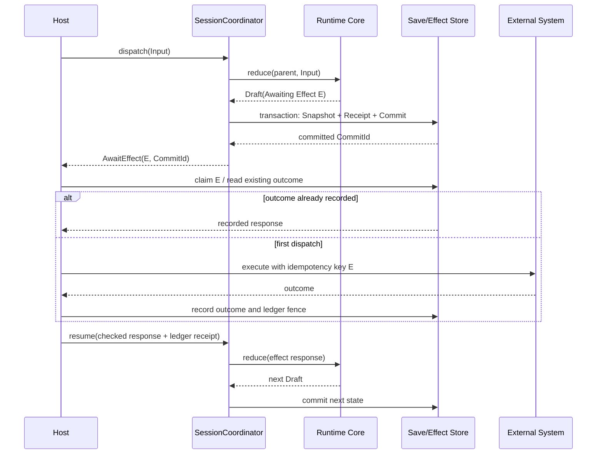

# Effect 与宿主状态

状态：已决定
日期：2026-09-01

## 核心边界

时间旅行只能自动恢复 Narrata 拥有且完整序列化的状态。宿主世界分为两部分：

```text
rewindable timeline
  RuntimeState / SceneState / pending interaction / pending effect

monotonic external world
  payment / server write / notification / achievement / effect ledger
```

把 Effect ledger 放进可回滚 Snapshot 是错误的：回到旧 Snapshot 会同时忘记“效果已经执行”，
随后再次扣款或重复写入。Ledger 必须以 `ExecutionId` 为 scope，独立于 branch/cursor 单调增长。

NixOS rollback 不恢复 `/var` 等 mutable state 是同一个边界，官方说明见
[How Nix Works](https://nixos.org/guides/how-nix-works/#rollbacks)。

## 无 callback 的协议

Core 不在锁内或 VM 执行中调用宿主：

```text
dispatch checked Input
  → TransitionDraft
  → durable Commit
  → CommittedRunResult::AwaitEffect
  → host/coordinator handles effect
  → checked EffectResponse
  → next transition
```

C# 可以把它封装成 `Task`，JavaScript 可以封装成 Promise/async iterator，但这些只是外层
体验；Rust continuation 仍是 `RuntimeState` 中的数据。

## Effect 类型

Effect 的 delivery 与 rewind policy 分开表达：

```rust
struct EffectRequest {
    id: EffectId,
    execution: ExecutionId,
    capability: CapabilityId,
    capability_version: CapabilityVersion,
    payload: CheckedValue,
    payload_digest: PayloadDigest,
    request_digest: EffectRequestDigest,
    delivery: DeliveryPolicy,
    rewind: RewindPolicy,
}

enum DeliveryPolicy {
    Reconcile,
    RecordedQuery,
    AtLeastOnceIdempotent,
    HostTransactional,
}

enum RewindPolicy {
    Reapply,
    ReuseRecordedResponse,
    Barrier,
    Compensatable { capability: CapabilityId },
}
```

`request_digest` 覆盖 capability、version、payload digest、delivery 与 rewind policy 的
canonical 表示；它不包含 `EffectId` 本身。`payload_digest` 便于内容校验，但不能单独充当
ledger 的请求身份，否则同一 payload 可以被换成不同的投递或回滚策略。

组合必须由 capability schema 预先允许，不能让故事脚本任意宣称“支付是可重放的”。宿主在
加载 Program 时完成 capability negotiation。

| 类别 | 示例 | 恢复/重放 |
| --- | --- | --- |
| Declarative reconcile | scene、camera target、audio channel desired state | 从当前 Snapshot 重新协调，可重复 |
| Recorded query | 服务器 flag、当前 locale、逻辑时钟输入 | 第一次结果写入 ledger/Receipt；重放复用结果 |
| Idempotent command | 以 Effect ID 去重的 inventory set、云端 upsert | 至少一次投递；宿主必须按 ID 去重 |
| External commit | 支付、发邮件、不可逆成就 | 幂等/事务保证之外还建立 rewind barrier |

## Effect ID

`EffectId` 必须在 retry 前确定，并跨崩溃重算为同一值：

```text
EffectId = SHA-256(
  "narrata-effect\0" ||
  ExecutionId || parent CommitId || InputDigest ||
  InstructionId || occurrence_ordinal ||
  EffectRequestDigest
)
```

必须包含 `ExecutionId`。两个玩家即使运行相同 Program、状态和选择，也不能共享一个支付
幂等键。包含 parent、instruction 和 ordinal 则保证同一玩家在不同剧情发生点执行相同
payload 时仍是不同 Effect；崩溃后重试同一个 transition 又保持相同 ID。

`ExecutionId` 在创建 timeline 时由宿主作为 checked input 提供，写入所有 Snapshot，并在
整个 fork DAG 中保持不变。复制为全新玩家/试玩实例时必须生成新的 `ExecutionId`。

## Commit-before-dispatch



宿主不得在收到未持久化的 `TransitionDraft` 时执行 Effect。只有带 Commit ID 的
`CommittedRunResult` 可以离开 coordinator。

## External Effect Ledger

Ledger 是不随时间线回滚、只允许向前转换的执行事实。实现可以使用 append-only ledger
events 并维护当前 materialized view；下面是该 view 的概念形状：

```rust
struct EffectLedgerEntry {
    execution: ExecutionId,
    effect: EffectId,
    request_digest: EffectRequestDigest,
    origin_commit: CommitId,
    status: LedgerStatus,
    rewind: RewindPolicy,
    committed_fence: Option<LedgerFence>,
}

enum LedgerStatus {
    Claimed { lease: LeaseId },
    Completed { response: ObjectId },
    Rejected { response: ObjectId },
    RetryableFailure { diagnostic: DiagnosticId },
    UnknownOutcome { diagnostic: DiagnosticId },
    Compensated { by_effect: EffectId },
}
```

同一 `(ExecutionId, EffectId)` 只能绑定一个 `request_digest`。不同 payload、capability
version 或 delivery/rewind policy 复用同一 ID 都是 corruption/conflict，不是 retry。

`LedgerFence` 是该 execution 内单调递增的外部事实序号。Claim/lease 不推进它；记录完成、
拒绝或经人工确认的 outcome 时才可以分配。每个 Runtime Commit 记录它已观察到的 fence；
完成 Barrier effect 后产生的 Commit 必须包含新的 fence。若当前 ledger 中存在比目标 Commit
fence 更新的未补偿 Barrier，恢复被拒绝。

Ledger 不因删除 branch 或加载旧存档而删除。只有整个 `ExecutionId` 按产品数据生命周期被
明确删除时，才能与其 timeline 一起清理。

## 崩溃窗口

| 崩溃位置 | 恢复行为 |
| --- | --- |
| pending Commit 前 | Effect 未向宿主发布；从 parent 重算 |
| pending Commit 后、dispatch 前 | 恢复 Commit，ledger 无结果，安全 dispatch |
| claim 后、外部调用前 | lease 到期后以同一 Effect ID retry |
| 外部调用后、ledger outcome 前 | 只能依赖外部系统幂等键/事务查询；否则为 `UnknownOutcome` |
| ledger outcome 后、Runtime resume 前 | 读取 recorded response，不再执行外部调用 |
| resume 后、next Commit 前 | 仍从 pending Commit 读取 ledger response，再次产生同一 next Commit |

因此 Narrata 不能承诺通用 exactly-once。可实现的是：

```text
at-least-once dispatch
+ stable idempotency key
+ durable response ledger
+ explicit unknown-outcome handling
```

没有幂等键、事务 API 或结果查询能力的外部 command，持久模式默认拒绝。开发者可以注册
需要人工确认 `UnknownOutcome` 的 capability，但不能把它标成安全重试。

## Rewind barrier

`Barrier` 表达语义上的不可逆，不等同于 delivery guarantee：

- Effect 完成后，ledger 分配 fence；
- response Commit 记录该 fence；
- 目标 Commit 的 fence 小于任一当前未补偿 Barrier fence 时，普通 rewind/load 返回
  `BlockedByExternalBarrier`；
- UI 可以把 barrier 显示成时间线上的锁；
- 管理员强制打开旧 Snapshot 只能进入 simulation/read-only execution，不能重新 dispatch
  external effect；
- compensation 是一个拥有新 Effect ID 的新命令，成功后 ledger 记录两者关系；它不删除
  原事实。

有一个严格受限的 crash-recovery 例外：若目标 Commit 正好处于 `AwaitingEffect(E)`，而
ledger 已记录同一个 `E` 的完成结果但 response Commit 尚未落盘，coordinator 可以在不向
宿主展示该旧状态、不接受其他 Input 的情况下自动消费 recorded response，补写 response
Commit。它恢复到 barrier 之后，不允许停留或游玩在 barrier 之前。其他较新 Barrier 仍然
阻止恢复。

对普通本地 VN，可完全不声明 Barrier capability，时间旅行保持自由。

## Declarative scene reconcile

画面、角色、相机和音频长期状态应保存在 `SceneState`：

```rust
struct SceneState {
    layers: Vec<LayerState>,
    actors: BTreeMap<ActorId, ActorState>,
    camera: CameraState,
    audio_channels: BTreeMap<AudioChannelId, AudioState>,
    interaction: Option<InteractionView>,
}
```

加载或 rewind 后，core/coordinator 输出 `ReconcileScene(target)`。宿主把实际 UI 调整到目标，
不重放“显示 A、隐藏 B、播放 C”命令历史。一次性粒子、震动等 presentation flourish 默认不
进入权威状态；需要恢复的内容必须提升为 declarative field。

音频播放位置、动画进度等是否精确恢复由 capability contract 声明：`Restart`、`Seek` 或
`BestEffort`。这属于呈现兼容性，不得影响故事分支。

## Recorded Query

Query 结果是外部事实：

1. pending query 先进入 committed Snapshot；
2. 宿主执行并验证 response schema；
3. response 写 ledger/Receipt；
4. Runtime 只消费 checked response；
5. 同一 Effect ID 的 replay/load 复用结果，不再次读取变化后的世界。

如果产品希望“每次加载都读取当前服务器值”，这不是时间旅行重放，而是新的外部 Input，
应创建新 transition/branch 并在产品语义中明确。

## 多 Effect

v1 每个 Runtime Session 最多有一个权威 pending Effect。这样 response ordering、snapshot 和
崩溃恢复没有组合歧义。

后续只有满足以下条件才允许 batch：

- 每个 Effect 有独立 ID；
- Program 明确 response join policy；
- receipt 对 response 使用固定排序，不依网络返回先后；
- cancellation、部分成功和 barrier 规则均已定义；
- 模型测试覆盖所有 response interleaving。

多个纯 `Reconcile` patch 可以由 coordinator 合并成一个 declarative target，不算并发
external Effect。

## 宿主状态模式

### Narrative-authoritative

所有影响分支的数据在 Runtime State；宿主只是 presenter。Save Commit 足够恢复。

### Federated save

宿主游戏世界也影响分支。安全点由 `SaveCoordinator` 产生：

```rust
struct CompoundSaveManifest {
    narrative: CommitId,
    host: HostSnapshotRef,
    program: ProgramArtifactId,
    content_lock: ContentLockId,
    ledger_fence: LedgerFence,
}
```

建议顺序：

1. Narrata 已处于 committed safe point；
2. 宿主创建 immutable Host Snapshot，返回 ref + digest；
3. 写 Compound Manifest；
4. CAS 更新用户 save slot；
5. 失败产生的 orphan 由双方 retention/GC 清理。

恢复必须共同验证 Narrata Commit、Host Snapshot、Program、Content Lock 与 ledger fence；不能
只恢复其中一半后继续。

### Federated Timeline Archive

单个 `CompoundSaveManifest` 只能恢复一个联合 checkpoint，不能据此宣称宿主世界的整个时间线
也可回溯。若宿主开启[完整用户时间线](./time-travel-and-save.md#完整时间线归档)，并且宿主状态
会影响分支，则必须额外提供：

```rust
struct HostTimelineManifest {
    execution: ExecutionId,
    coverage: TimelineCoverage,
    entries: Vec<HostTimelineEntry>,
}

struct HostTimelineEntry {
    narrative: CommitId,
    host: HostSnapshotRef,
    host_digest: HostSnapshotDigest,
    ledger_fence: LedgerFence,
}
```

每个对外承诺可联合 rewind/load 的 Narrative Commit 都必须有对应 entry，或者由宿主自己的
版本化时间线证明能够精确构造该 Host Snapshot。缺少映射的点只能标记为 narrative-only view，
不能恢复一半后继续执行。Host Timeline 与 Narrative Archive 使用相同 `ExecutionId` 和明确的
coverage；导入时共同验证后才发布任何 Ref。

支付、通知、服务器写入等 monotonic external fact 不进入 Host Timeline。Ledger 和 Barrier 仍
独立存在；完整归档可以展示这些事实，却不能把它们变成可撤销状态。

### External-authoritative

服务器或其他系统是权威。Narrata 只保存引用与已记录 response，并对不可逆改变使用 Barrier。
加载旧剧情不能宣称服务器也回到旧状态。

## 必需验证

- 对支持幂等键或 `HostTransactional` 的测试系统，同一 Effect 在所有崩溃窗口中最多产生
  一个外部业务结果；测试 host 必须主动重复投递；
- 同一 Effect ID 配不同 payload 被拒绝；
- 两个 Execution 运行完全相同 trace 仍得到不同 Effect ID；
- rewind 到 Barrier 前返回 typed error，不能先加载再警告；
- ledger 已完成但 response Commit 未写入时，只允许自动 catch-up，不重复 dispatch；
- compensation 不删除原 ledger entry；
- Recorded Query 重放不调用 query adapter；
- Reconcile 在任意历史点都能从单个 SceneState 建立目标画面；
- Federated save 任一半缺失、hash 不符或版本不兼容都原子失败；
- Federated Timeline 对每个可联合恢复点都有 Host Timeline entry，缺失映射的点不会被报告为
  可继续执行。
