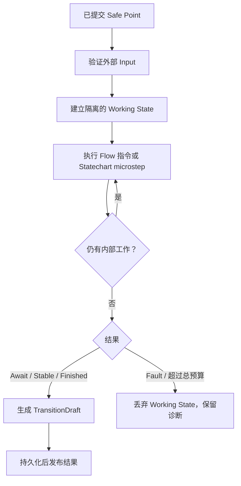

# 确定性运行模型

状态：已决定（v0.1 语义基线）
日期：2026-09-01

## 目标

Narrata core 接收不可变 Program、已验证的 Runtime State 和一个显式 Input，产生新的状态及
可观察结果。相同的三者与相同预算策略必须产生相同的结果。

```text
reduce(program, committed_state, input, limits)
  -> TransitionDraft(next_state, result, receipt)
```

数据库、文件、墙上时间、系统随机数、网络、Unity 对象和 JavaScript 对象都不能由 core
直接读取。它们只能通过 `Input` 或 `EffectResponse` 进入。

## 两种控制模型各司其职

```text
Statechart：长生命周期、事件驱动、层级/并行模式
Flow VM：    短生命周期、顺序执行、表达式/调用/选择
```

Statechart 可以在 entry action 启动 Flow；Flow 可以 raise 内部事件。二者共享一个
macrostep 和同一份事务性 working state，但不能把每句台词强行展开成 Statechart state。

v0.1 先实现 Flow VM。Statechart 接入时不能改变 Input、Commit、safe point 或 Effect 的
基础协议。

## 权威类型

以下是语义形状，不承诺最终字段名：

```rust
struct RuntimeState {
    semantics_version: SemanticsVersion,
    execution: ExecutionId,
    program: ProgramArtifactId,
    status: RuntimeStatus,
    vm: VmState,
    charts: StatechartState,
    values: ValueStore,
    internal_events: VecDeque<InternalEvent>,
    rng: Option<DeterministicRngState>,
    logical_time: LogicalTime,
    scene: SceneState,
    turn: Turn,
}

enum RuntimeStatus {
    Ready,
    Awaiting(AwaitState),
    Finished(Value),
}

enum AwaitState {
    Interaction(PendingInteraction),
    Effect(PendingEffect),
}
```

`Faulted` 不属于可继续的 committed state。失败的 macrostep 保留诊断和仅供调试的 working
state，但对玩家可恢复的 head 仍指向最后一个成功 Commit。

必须使用不同 newtype 表示以下身份：

```text
ProgramArtifactId  精确编译产物
ExecutionId        一个玩家/运行实例及其全部分支的权威 scope
FlowId             作者语义身份
InstructionId      可迁移 continuation 身份
StateId            Statechart 身份
CommitId           不可变提交身份
InteractionId      一次等待交互
EffectId           一次宿主效果意图
RefRevision        可变 Ref 的并发版本
```

禁止把它们统一成 `String`、`Uuid` 或裸 `[u8; 32]` 后靠注释区分。

## Value v0

第一阶段只允许能够确定性比较、编码和跨平台恢复的值：

```rust
enum Value {
    Null,
    Bool(bool),
    I64(i64),
    String(Arc<str>),
    List(Vec<Value>),
    Record(BTreeMap<SymbolId, Value>),
    Variant {
        type_id: TypeId,
        variant_id: VariantId,
        payload: Box<Value>,
    },
    Entity(EntityId),
}
```

v0 不加入浮点数、任意 JSON object、宿主指针或 closure。后续若加入浮点数，必须先规定
NaN、Infinity、负零、编码和跨 native/Wasm 分支比较；不能直接把 `f64` 放入存档契约。

以下值永远不能进入 `RuntimeState`：

```text
Rust trait object / Future / native pointer
C# delegate / Unity GameObject
JavaScript object / DOM node
file descriptor / socket / database connection
wall-clock handle / operating-system RNG
```

## Input

外部世界进入 core 的每个事实都有类型和 ID：

```rust
enum RuntimeInput {
    Start { execution: ExecutionId, request_id: InputId },
    Advance { interaction: InteractionId, request_id: InputId },
    Select {
        interaction: InteractionId,
        choice: ChoiceId,
        request_id: InputId,
    },
    Event(ExternalEvent),
    EffectResponse(CheckedEffectResponse),
    LogicalTimeAdvanced { to: LogicalTime, request_id: InputId },
}
```

FFI、网络或存档中的 loose payload 不能直接构造这些类型。边界 parser 必须验证版本、大小、
枚举、ID 形状、capability response schema 和引用，再返回 checked domain value。

重复 `InputId` 必须有确定行为：如果内容摘要相同，返回既有结果；如果同一 ID 携带不同
内容，返回 `InputIdConflict`，不能执行第二次。

`ExecutionId` 在初始 `Start` 时建立，之后写入每个 Snapshot；从旧点分叉继续沿用它，复制
成一个全新玩家/试玩实例则必须使用新的 ID。它也是 Effect ledger 与幂等键的隔离边界。

## Macrostep 与 microstep

采用 W3C SCXML 的 run-to-completion 核心概念，但使用 Narrata 自有 typed IR：一个外部
Input 只在前一个 macrostep 完成后进入；由它触发的 Flow 指令、eventless transition 和
internal event 全部先处理，再接受下一个外部 Input。



确定顺序至少固定以下规则：

1. 外部 Input 入队和校验；
2. Statechart 选择 transition；
3. 从最深 active state 开始 exit；
4. 执行 transition action；
5. 从祖先到后代 entry；
6. Flow 指令按 Program 中显式顺序执行；
7. 内部事件 FIFO，优先于下一个外部 Input；
8. eventless transition 在稳定前继续执行；
9. 同优先级冲突必须由固定规则解析或编译期拒绝。

Phase 4 实现 Statechart 前，必须把更完整的 transition conflict 和 parallel region 顺序写成
golden trace，不能只依赖代码结构暗示。

## Safe point

持久 Commit 只在外部可观察的一致状态创建：

| 状态 | 可持久化 | 原因 |
| --- | --- | --- |
| `Awaiting::Interaction` | 是 | continuation、合法选择和 scene 已完整 |
| `Awaiting::Effect` | 是，而且外部 dispatch 前必须提交 | 崩溃后能识别 pending Effect |
| `Ready` 且 macrostep 已稳定 | 是 | internal queue 已耗尽 |
| `Finished` | 是 | 终态完整 |
| 指令执行一半 | 否 | 可能只写了一部分值或 frame |
| Statechart microstep 序列中间 | 否 | exit/action/entry 尚未完成 |
| internal event queue 尚未排空 | 否 | 宿主会观察到半个 macrostep |
| 仅因调度 slice budget 暂停 | 否 | 只允许进程内继续 |

用户在非 safe point 请求保存时，API 返回 `SaveDeferred`，并在下一个 safe point 完成，而
不是导出半状态。

`Awaiting::Effect` 也必须位于稳定边界。Statechart exit/transition/entry action 只能先把 Effect
intent 写入事务性 outbox；完成当前 microstep、排空内部确定性工作并得到一致 active
configuration 后，才发布 Await。若业务必须先取得外部结果再决定转移，作者需要建模一个
显式 `Awaiting...` state，让 response 成为下一次 external Input，不能在半条 transition 中
阻塞宿主。

## Result 与持久化发布

纯 core 产生 `TransitionDraft`；它尚未获得持久语义：

```rust
struct TransitionDraft {
    parent: CommitId,
    next_state: RuntimeState,
    result: DraftResult,
    receipt: TransitionReceipt,
}

enum DraftResult {
    AwaitInteraction(InteractionView),
    AwaitEffect(EffectRequest),
    Stable,
    Finished(Value),
}
```

`SessionCoordinator` 在 store 中提交 draft 后，才对宿主发布带 `CommitId` 的
`CommittedRunResult`。特别是 external effect，不能先执行再尝试保存 pending state。

Core 不持有 `SaveStore`、文件系统或数据库句柄；coordinator 可以是原生 Rust 层、C# host
或 JavaScript host，但必须遵循相同的 commit-before-publish 协议。

## 预算与失败

区分两个预算：

- **slice budget**：为了主线程/Wasm 调度临时让出控制权；working state 仍留在 session
  内部，对宿主不可观察，也不是存档点；
- **macrostep hard limit**：限制一整个 macrostep 的 instruction、microstep、internal event、
  call depth 和 allocation。超限产生确定性 Fault 并丢弃该 macrostep。

`continue_slice` 不接收新 Input。预算值可以影响何时让出 CPU，但不能影响最终状态、Effect
顺序或 Commit hash。测试必须用多个 slice size 运行同一 trace 并得到相同结果。

## 随机与时间

v0.1 不提供随机和真实时间。引入时遵守：

- RNG algorithm 和版本是 Program semantics 的一部分；
- snapshot 保存能够无歧义继续的完整 RNG state；
- 至少有跨平台固定 test vector；
- 墙上时间只能作为带 `InputId` 的 `LogicalTimeAdvanced` 或 Effect Response 进入；
- metadata 中供展示的保存时间不能参与 Runtime State 或 Commit 确定性摘要。

## 核心不变量

1. `state.program` 必须等于 Commit 固定的 `ProgramArtifactId`。
2. `ExecutionId` 在一个 timeline 的所有 ancestor/fork 中保持不变。
3. `Ready` 没有 pending interaction/effect；`Awaiting` 恰好有一个对应 pending object。
4. pending object 的 Stable ID、capability 和 schema 必须存在于固定 Program 中。
5. 外部 Input 只能在与当前 `RuntimeStatus` 匹配时接受。
6. 每个 macrostep 要么整体提交，要么对 committed state 无影响。
7. 同一 Program、parent Commit 与 Input 产生相同 state hash、receipt 和 Effect 序列。
8. 所有集合迭代、transition priority 和 diagnostic ordering 都是确定的。
9. decoder 的成功只证明数据形状；引用、状态组合和领域规则还必须由构造器验证。

## 必需验证

- golden trace：`say → advance → choice → call → return → finish`；
- 同一 trace 在不同 slice budget 下结果相同；
- snapshot 后继续与不中断继续结果相同；
- 非法 Choice ID、过期 Interaction ID、重复/冲突 Input ID 被拒绝且不改状态；
- macrostep 任一指令 Fault 都回到 parent Commit；
- native 与 Wasm 对同一 trace 产生相同 state/receipt hash；
- decoder fuzzing 覆盖深度、长度、整数边界、未知版本和悬空 Stable ID。

W3C SCXML 对 macrostep、internal queue 和 run-to-completion 的规范定义见
[SCXML §Algorithm for SCXML Interpretation](https://www.w3.org/TR/scxml/#AlgorithmforSCXMLInterpretation)。
Temporal 对重放确定性和外部操作离开 replay path 的要求提供了另一项工程验证：
[Temporal Workflow Definition](https://docs.temporal.io/workflow-definition#deterministic-constraints)。
