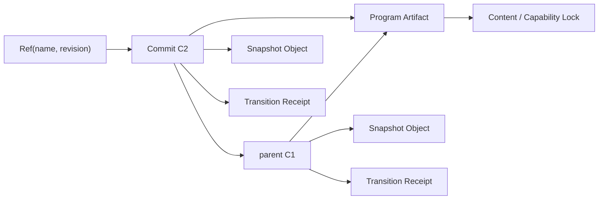

# 时间旅行与存档

状态：已决定；编码库与性能阈值仍需 Phase 0 spike 证明
日期：2026-09-01

## 核心决定

Narrata 使用**不可变 Snapshot Commit 图 + 可变 Ref**。恢复直接加载完整 continuation；
Transition Receipt 负责解释“怎样来到这里”、验证确定性和支持调试重放。

这不是纯 Event Sourcing。通用 Event Sourcing 通常把事件流当作真相、snapshot 当缓存；
Narrata 反过来把版本化的完整 Runtime State 当恢复真相，原因是：

- continuation 很小且可以显式序列化；
- 正常载入不应从故事开头重放几万步；
- 新 Program 重放旧事件容易产生不同命令序列；
- 精确旧 Program Artifact 可能仍可直接恢复，而事件 upcaster/migration 代价很高；
- 用户存档需要明确回答“此刻在等哪个选择/Effect”，不能只依赖推演。

事件溯源关于 append-only、snapshot、幂等和 optimistic concurrency 的经验仍然适用，参见
[Microsoft Event Sourcing pattern](https://learn.microsoft.com/en-us/azure/architecture/patterns/event-sourcing)。

## 术语

| 名称 | 含义 |
| --- | --- |
| `Snapshot` | 一个 safe point 上完整、已验证、可继续的 `RuntimeState` 编码 |
| `TransitionReceipt` | parent、Input、输出摘要、Effect 和 next state 摘要的不可变记录 |
| `Commit` | 把 parent、Program、Snapshot 和 Receipt 绑定在一起的不可变对象 |
| `Ref` | 带 revision 的可变命名指针，例如 save slot 或 branch head |
| `Cursor` | 当前 session 正在查看/执行的 Commit；可以落后于 branch head |
| `Pin` / `Root` | 阻止 Commit 及其依赖 closure 被 GC 的引用 |
| `SaveBundle` | 导出/同步一个 root Commit 所需对象 closure 的便携容器 |

“checkpoint”是创建 Commit 的动作或 safe point；“snapshot”是状态对象；两词不能在 API 中
混用。

## 对象图



所有方框中除 Ref 外都是 immutable object。对象只有在 hash 验证通过后才可见；Ref 更新是
唯一需要并发控制的写操作。

## 身份与编码

### Object ID

v1 使用 256-bit SHA-256，并做 domain separation：

```text
ObjectId = SHA-256(
  "narrata-object\0" || object_kind || schema_version || canonical_payload
)
```

`CommitId`、`SnapshotId`、`ProgramArtifactId` 和 `ReceiptId` 是不同 newtype。即使内部摘要
算法相同，编译器也不能允许互换。

### Canonical payload

持久对象采用 Narrata 定义的 deterministic CBOR profile：

- RFC 8949 core deterministic encoding；
- definite length；
- map key 使用固定整数 tag 并按编码排序；
- 最短整数编码；
- v1 payload 不允许浮点数、重复 key 或不规范编码；
- 文本按原始 UTF-8 bytes 参与 hash，不做平台相关 Unicode normalization；
- 未知 schema version 只能由显式 decoder/migration 处理。

RFC 8949 只提供建立 deterministic profile 的规则，不会自动使任意 CBOR encoder 稳定。
Phase 0 必须通过跨版本 golden vectors 选定或实现 encoder。禁止直接 hash `serde` 对任意
CBOR/JSON 的输出。

Protobuf 仍可用于 C ABI/Wasm 的 request/response，但不能直接成为 Object ID 的 hash
preimage；官方明确说明 deterministic Protobuf 不是 canonical，见
[Proto Serialization Is Not Canonical](https://protobuf.dev/programming-guides/serialization-not-canonical/)。

压缩和加密属于 storage envelope，不参与 Object ID。这样 zstd 版本、压缩级别或宿主加密
方案变化不会改变逻辑对象身份。

## Snapshot v1

Snapshot 必须完整表达所有会影响未来结果的 rewindable state：

```rust
struct SnapshotV1 {
    semantics_version: SemanticsVersion,
    execution: ExecutionId,
    program: ProgramArtifactId,
    status: RuntimeStatus,
    vm: VmState,
    charts: StatechartState,
    values: ValueStore,
    internal_events: VecDeque<InternalEvent>,
    rng: Option<DeterministicRngState>,
    logical_time: LogicalTime,
    scene: SceneState,
    turn: Turn,
}
```

外部 Effect ledger、墙上保存时间、用户展示名称、云同步 ETag 和宿主数据库连接不属于
Snapshot。前四者分别由 Effect Store 或 Ref metadata 管理；连接永远不可序列化。

v1 在每个持久 safe point 编码完整 Snapshot。先用简单、可证明的全量快照建立正确性，
不要第一版就实现复杂 delta chain。测量证明存储或延迟不合格后，再把 `ValueStore`、scene
或大 bytes 拆成可共享 object；Commit 与 Ref 协议无需因此改变。

## Transition Receipt

Receipt 是审计和重放证据，不是可执行回调：

```rust
struct TransitionReceiptV1 {
    execution: ExecutionId,
    program: ProgramArtifactId,
    parent: CommitId,
    input: CheckedInputRecord,
    input_digest: InputDigest,
    emitted_effects: Vec<EffectRecord>,
    result_kind: ResultKind,
    next_snapshot: SnapshotId,
    instruction_count: u64,
    microstep_count: u64,
    semantics_version: SemanticsVersion,
}
```

不把 wall clock、线程 ID 或内存地址放入确定性 payload。可观测 telemetry 另存，不参与
Receipt ID。

Receipt 支持：

- 从任意已知 Snapshot 重放后比较 next Snapshot/Effect hash；
- debugger 时间线展示；
- crash/bug 报告最小复现；
- migration 前后的 conformance 检查。

正常 `load` 不重放 Receipt。

## Commit

```rust
struct CommitV1 {
    parent: Option<CommitId>,
    execution: ExecutionId,
    program: ProgramArtifactId,
    snapshot: SnapshotId,
    cause: CommitCause,
    ledger_fence: LedgerFence,
    turn: Turn,
}

enum CommitCause {
    Genesis,
    RuntimeTransition(ReceiptId),
    Migration(MigrationReceiptId),
}
```

`ledger_fence` 是此 Commit 已观察到的单调 external effect 序号；它参与恢复时的 Barrier
检查。该值只能由 checked Effect Response/Ledger Receipt 推进。

初始 Commit 没有 parent，cause 为 `Genesis`。普通、迁移和恢复后继续产生的 Commit 都只有一个
parent。时间线因此是可分叉的单父 DAG；v1 不支持合并两个剧情未来。若未来需要多人协作或
CRDT，那是独立能力，不能把普通剧情分支伪装成自动 merge。

Commit、Snapshot、parent 和 Receipt 的 `ExecutionId` 必须一致；validator 不能只相信其中
一个字段。

同一 parent 上以相同 Input 得到相同结果时，Commit ID 相同并可以去重。

## Ref 与并发

```rust
struct RefValue {
    revision: RefRevision,
    commit: CommitId,
}

compare_and_swap_ref(
    key: RefKey,
    expected: Option<RefRevision>,
    next: CommitId,
) -> Result<RefValue, RefConflict>
```

Ref namespace 至少包括：

```text
saves/<owner>/<slot>
branches/<timeline>/<branch>
bookmarks/<owner>/<name>
active/<session>
temporary/<lease>
```

generation/revision 只用于 Ref 并发和 UI 排序，不是 Commit identity。两个设备同时覆盖同一
save slot 时，一个 CAS 成功，另一个收到携带实际 revision/Commit 的 `RefConflict`；禁止
last-write-wins 静默丢失玩家历史。

Receipt 同时形成 Input 去重索引：同一 `(ExecutionId, InputId)` 再次提交时，只有 parent 与
input digest 都相同才返回既有 Commit；parent 或内容不同则为 `InputIdConflict`。该索引可从
Receipt 重建，不进入 rewindable Runtime State。

## 创建 checkpoint

`SessionCoordinator` 执行以下顺序：

1. Core 从已知 parent Commit 与 checked Input 产生 `TransitionDraft`。
2. 验证 `next_state` 是 safe point，并再次检查所有内部引用。
3. canonical encode Snapshot，计算并写入 `SnapshotId`。
4. canonical encode Receipt，计算并写入 `ReceiptId`。
5. 写入引用 parent、Program、Snapshot、Receipt 的 Commit。
6. 以 expected revision CAS 更新目标 branch/active Ref。
7. 提交事务后，才向宿主发布 `CommittedRunResult`。

步骤 3–6 对 reference adapter 是同一数据库事务。失败时 committed parent 保持不变；已写但
未引用的 immutable object 可以稍后 GC。

## 恢复

加载 Ref 或直接加载 Commit 时：

1. 限制输入 bundle/object 的总大小、对象数、单对象大小和嵌套深度；
2. 验证每个 envelope、kind、schema version 和 Object ID；
3. 解析 Commit，并验证 parent、Snapshot、Receipt、Program 引用存在且类型正确；
4. 获取 Commit 固定的精确 Program Artifact closure；
5. decode Snapshot 到 untrusted wire type；
6. 通过 checked constructor 验证 RuntimeStatus、frame、Stable ID、queue 和 Program 对应关系；
7. 检查 Effect ledger fence、回滚屏障和可选 Host Snapshot；
8. 若 Snapshot 正在等待的同一 Effect 已有 recorded outcome，只允许 coordinator 自动消费
   response 并补齐 response Commit，不能向玩家暴露 barrier 前状态；
9. 构造 Runtime Session，并输出 declarative scene reconcile；
10. 只有以上全部成功才更新 active Ref/cursor。

恢复结果必须是显式联合类型：

```text
Exact
Migrated { migration_commit }
NeedsProgram { artifact_id }
BlockedByExternalBarrier { effect_id }
Incompatible { diagnostic }
Corrupt { object_id, diagnostic }
```

绝不根据标题、数组位置、当前文件行号或相似字符串猜测成功。

## Rewind、redo 与分支

一个 session 同时保存 `selected_branch` 和 `cursor`：

- rewind 只把 cursor 移到所选 ancestor；历史 Commit 不变；
- cursor 落后于 branch head 时，可以沿该 branch 已知路径 redo；
- 从非 head cursor 接受新 Input 时创建新 branch ref，parent 是 cursor；
- 原 branch head 继续作为 root，旧未来不会立刻消失；
- 如果新执行得到既有 child 的同一 Commit ID，可直接复用；
- 多个可选 child 时，redo 必须显式选择 branch，不能任意挑一个。

普通玩家 UI 可以隐藏 branch 细节，只展示“回退/前进”；debugger 必须展示完整 fork。自动
保留的 abandoned branch 使用有期限 pin，用户 save/bookmark 则长期保留。

一个 parent/child chain 中 `ExecutionId` 必须相同。把存档复制成全新玩家不是普通 fork：
coordinator 在允许的 safe point 重新绑定 Execution ID、重新生成 pending interaction scope、
不复制 external ledger，并创建无 parent 的新 Genesis Commit。若存在 pending external Effect
或未处理 Barrier，clone 默认拒绝；跨 Execution 的来源关系只写审计 provenance，不作为
Commit parent。

## Save slot 与 SaveBundle

Save slot 只是 Ref，不复制 Runtime State。重命名或移动 slot 不改变 Commit。

跨设备/文件导出使用：

```rust
struct SaveBundleManifestV1 {
    root: CommitId,
    objects: Vec<ObjectDescriptor>, // 按 ObjectId 排序
    optional_host_manifest: Option<HostSaveManifestId>,
}
```

Bundle 包含从 root 可达、接收方尚未拥有的 closure。导入先校验全部对象，再以单次 CAS 创建
目标 Ref。REZICS 可以把 bundle/object 作为 opaque 用户数据保存，但不能解析部分字段后
重建另一套运行语义。

## Reference SaveStore

Core 只定义行为，`narrata-store` 提供：

```rust
trait SaveStore {
    fn get_object(&self, id: ObjectId) -> Result<Bytes, StoreError>;
    fn put_object(&mut self, object: CheckedObject) -> Result<PutOutcome, StoreError>;
    fn read_ref(&self, key: &RefKey) -> Result<Option<RefValue>, StoreError>;
    fn commit(&mut self, tx: CommitTransaction) -> Result<CommitOutcome, StoreError>;
    fn roots(&self) -> Result<Vec<Root>, StoreError>;
    fn collect(&mut self, policy: RetentionPolicy) -> Result<GcReport, StoreError>;
}
```

第一批 adapter：

- `MemoryStore`：模型测试、property test 和嵌入式临时运行；
- `SqliteStore`：native reference implementation，在一个事务中写 object/commit/ref/effect
  ledger；
- Wasm host adapter：由 JavaScript 使用 IndexedDB transaction 实现同一语义。

自制目录 + rename 的文件存储留到 SQLite 版本通过 crash test 后；不同 OS 的 fsync、目录
同步、杀进程和 antivirus 行为不应成为 v1 正确性的前提。

## GC

GC 是 mark-and-sweep：

1. 收集所有 Ref、未过期 Pin、active session 和 Effect Store root；
2. 标记 Commit parent、Snapshot、Receipt、Program Artifact、Content Lock 与 Host Manifest；
3. 在同一事务/租约视图中清除未标记且超过 grace period 的对象；
4. 输出可审计 `GcReport`，包括按 kind 计数和 bytes，不暴露 payload。

必须保留：

- 当前 Ref；
- 时间阈值内最后存在的一个 predecessor，使“保留 N 天”语义仍能回到阈值时刻；
- pending external effect 所引用的 Commit/response；
- migration 仍需读取的 source artifact；
- GC 开始后新事务的 temporary pin。

Nix 对 profile/GC root 交接的同步实现说明了竞态风险，见
[`profiles.cc#L86-L93`](https://github.com/NixOS/nix/blob/4750701db3802868445276c1a09c2f065a5a4bc6/src/libstore/profiles.cc#L86-L93)。

## 安全与资源上限

SaveBundle 和云端存档始终是不可信输入：

- decoder 必须无 panic，限制 bytes、深度、字符串、集合、frame、queue 和 object 数；
- hash 完整不代表内容被授权或属于当前用户；
- payload 中不执行脚本、不加载 native library、不跟随文件路径；
- 个人数据与密钥尽量不进入 Receipt；宿主负责 envelope encryption 和访问控制；
- 错误返回 Object ID 与路径，不回显敏感 payload；
- 导入过程不能在验证完成前创建长期 Ref。

## 验收不变量

```text
restore(commit(run(S, I))) == run(restore(commit(S)), I)
```

```text
same Program + parent Commit + Input
=> same SnapshotId + ReceiptId + ordered Effect trace + CommitId
```

```text
任意持久化步骤被强制终止后：
Ref 要么仍指向旧的完整 Commit，要么指向新的完整 Commit；不能悬空。
```

还必须验证：

- rewind 后沿同一路径重放复用原 Commit；
- rewind 后不同选择创建 fork 且旧 head 仍可读；
- CAS 冲突不覆盖获胜者；
- GC 不删除任何 root closure，也最终删除过期 orphan；
- bundle 缺对象、对象 kind 置换、hash 不符和超限输入全部原子失败；
- old schema 只能经注册 decoder/migration 进入 checked type。
