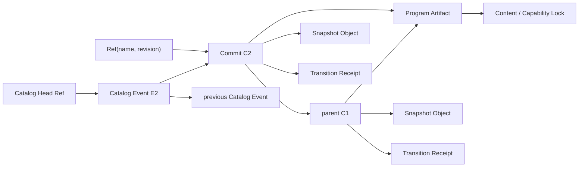

# 时间旅行与存档

状态：已决定；编码库与性能阈值仍需 Phase 0 spike 证明
日期：2026-09-01

与 2026-10-05 决定的关系：不可变提交图、Ref、普通存档与完整时间线的区分保留为 kernel 能力。
后端接口收窄为[存储与存档契约](../contracts/storage-and-saves.md) 的五个原语
（[决定 8](../product/decisions.md)），Snapshot 不再包含文本（[决定 2](../product/decisions.md)）。
存档引擎、键布局、校验边界与 GC 由 [ADR 0014](../adr/0014-save-engine-key-layout.md) 决定；
其中与领域无关的部分（对象、Ref、Pin、GC、Checkpoint Bundle）属于 kernel 历史层，节点栈等新领域
的通用提交、transitions 去重、会话 API 与恢复的信任边界由
[ADR 0015](../adr/0015-kernel-history-layer.md) 决定。下文描述 Stage 1–5 的提交模型，与这两份
ADR 冲突处以 ADR 为准。

## 核心决定

Narrata 使用**不可变 Snapshot Commit 图 + 可变 Ref**。恢复直接加载完整 continuation；
Transition Receipt 负责解释“怎样来到这里”、验证确定性和支持调试重放。

Core 为每个已提交的语义转换产生 Commit/Receipt，但这不等于产品默认承诺永久保存或展示
“完整用户时间线”。普通 checkpoint 与完整时间线是两个显式能力：前者恢复一个目标点，
后者在用户或宿主开启后，长期保留该 timeline 的所有语义转换、分支和存档目录变更。

这不是纯 Event Sourcing。通用 Event Sourcing 通常把事件流当作真相、snapshot 当缓存；
Narrata 反过来把版本化的完整 Runtime State 当恢复真相，原因是：

- continuation 很小且可以显式序列化；
- 正常载入不应从故事开头重放几万步；
- 新 Program 重放旧事件容易产生不同命令序列；
- 精确旧 Program Artifact 可能仍可直接恢复，而事件 upcaster/migration 代价很高；
- 用户存档需要明确回答“此刻在等哪个选择/Effect”，不能只依赖推演。

事件溯源关于 append-only、snapshot、幂等和 optimistic concurrency 的经验仍然适用，参见
[Microsoft Event Sourcing pattern](https://learn.microsoft.com/en-us/azure/architecture/patterns/event-sourcing)。

## 术语

| 名称 | 含义 |
| --- | --- |
| `Snapshot` | 一个 safe point 上完整、已验证、可继续的 `RuntimeState` 编码 |
| `TransitionReceipt` | parent、Input、输出摘要、Effect 和 next state 摘要的不可变记录 |
| `Commit` | 把 parent、Program、Snapshot 和 Receipt 绑定在一起的不可变对象 |
| `Ref` | 带 revision 的可变命名指针，例如 save slot 或 branch head |
| `Cursor` | 当前 session 正在查看/执行的 Commit；可以落后于 branch head |
| `Pin` / `Root` | 阻止 Commit 及其依赖 closure 被 GC 的引用 |
| `CheckpointBundle` | 导出/同步一个 root Commit 及其对象 closure 的单点存档容器 |
| `TimelineCatalogEvent` | 完整时间线中 save、bookmark 和 branch 目录变更的不可变语义记录 |
| `TimelineArchiveBundle` | 导出一个 timeline 的多 root、目录日志、会话视图和对象 closure 的容器 |

“checkpoint”是创建 Commit 的动作或 safe point；“snapshot”是状态对象；两词不能在 API 中
混用。

## 持久化能力与承诺边界

Narrata 区分以下产品能力；不能用一个 `include_history: bool` 模糊它们的保留与隐私语义：

| 能力 | 普通 checkpoint | 完整用户时间线 |
| --- | --- | --- |
| 恢复目标 Runtime State | 必须 | 必须 |
| 目标 Commit 的必要祖先 closure | 随 bundle/本地 root 保留 | 保留 |
| abandoned branch、其他 branch head | 不保证，受 lease/GC 影响 | 自启用边界起保留 |
| save/bookmark 的创建、覆盖、改名、删除历史 | 不记录，只保留当前 Ref | 记录为 Catalog Event |
| 当前 cursor 与 selected branch | session metadata，可不随单点存档导出 | 进入 archive manifest |
| 导出格式 | `CheckpointBundle` | `TimelineArchiveBundle` |

完整时间线是**默认关闭、显式启用**的宿主能力。启用后只记录会改变叙事或时间线目录的
语义操作，例如 checked Input、Effect Response、branch、save 和 bookmark 变更；鼠标移动、
打开菜单、无效输入、取消对话框等 UI 行为不属于 Narrata 时间线。若产品需要行为分析或安全
审计，应使用独立、具有独立同意和保留策略的系统，不能复用 Timeline Archive。

启用不能补造此前已经 GC 或从未记录的历史：

```rust
enum TimelineRecordingMode {
    Standard,
    Complete { coverage: TimelineCoverage },
}

enum TimelineCoverage {
    FromBaseline { baseline: CommitId },
    Imported { baseline: CommitId, source: TimelineArchiveManifestId },
}
```

`Complete` 的“完整”只对 `coverage` 起点之后成立。UI、API 和导出 manifest 必须显示该范围，
不能仅根据当前最早可见 Commit 猜测历史完整。关闭记录时，宿主必须显式选择 `Seal`（物化并
保留只读 archive）或 `Delete`（移除 archive/Catalog root，使对象在无其他 root 后可由 GC
回收）；停止记录本身不能暗示旧数据已经物理删除。以后再次开启会创建新的
`RecordingStarted` 和 coverage segment，不能越过未记录区间延长旧 archive。

## 对象图



Catalog 路径只在完整时间线中存在。所有方框中除两个 Ref 外都是 immutable object。对象只有
在 hash 验证通过后才可见；Ref 更新是唯一需要并发控制的写操作。

## 身份与编码

### Object ID

v1 使用 256-bit SHA-256，并做 domain separation：

```text
ObjectId = SHA-256(
  "narrata-object\0" || object_kind || schema_version || canonical_payload
)
```

`CommitId`、`SnapshotId`、`ProgramArtifactId`、`ReceiptId`、`TimelineCatalogEventId` 和
`TimelineArchiveManifestId` 是不同 newtype。即使内部摘要算法相同，编译器也不能允许互换。

### Canonical payload

持久对象采用 Narrata 定义的 deterministic CBOR profile：

- RFC 8949 core deterministic encoding；
- definite length；
- map key 使用固定整数 tag 并按编码排序；
- 最短整数编码；
- v1 payload 不允许浮点数、重复 key 或不规范编码；
- 文本按原始 UTF-8 bytes 参与 hash，不做平台相关 Unicode normalization；
- 未知 schema version 只能由显式 decoder/migration 处理。

RFC 8949 只提供建立 deterministic profile 的规则，不会自动使任意 CBOR encoder 稳定。
Phase 0 必须通过跨版本 golden vectors 选定或实现 encoder。禁止直接 hash `serde` 对任意
CBOR/JSON 的输出。

Protobuf 仍可用于 C ABI/Wasm 的 request/response，但不能直接成为 Object ID 的 hash
preimage；官方明确说明 deterministic Protobuf 不是 canonical，见
[Proto Serialization Is Not Canonical](https://protobuf.dev/programming-guides/serialization-not-canonical/)。

压缩和加密属于 storage envelope，不参与 Object ID。这样 zstd 版本、压缩级别或宿主加密
方案变化不会改变逻辑对象身份。

## Snapshot v1

Snapshot 必须完整表达所有会影响未来结果的 rewindable state：

```rust
struct SnapshotV1 {
    semantics_version: SemanticsVersion,
    execution: ExecutionId,
    program: ProgramArtifactId,
    status: RuntimeStatus,
    vm: VmState,
    charts: StatechartState,
    values: ValueStore,
    internal_events: VecDeque<InternalEvent>,
    rng: Option<DeterministicRngState>,
    logical_time: LogicalTime,
    scene: SceneState,
    turn: Turn,
}
```

外部 Effect ledger、墙上保存时间、用户展示名称、云同步 ETag、Timeline Recording Policy、
Catalog Event 和宿主数据库连接不属于 Snapshot。它们分别由 Effect Store、Ref/Archive
metadata 或宿主策略管理；连接永远不可序列化。

v1 在每个持久 safe point 编码完整 Snapshot。先用简单、可证明的全量快照建立正确性，
不要第一版就实现复杂 delta chain。测量证明存储或延迟不合格后，再把 `ValueStore`、scene
或大 bytes 拆成可共享 object；Commit 与 Ref 协议无需因此改变。

## Transition Receipt

Receipt 是审计和重放证据，不是可执行回调：

```rust
struct TransitionReceiptV1 {
    execution: ExecutionId,
    program: ProgramArtifactId,
    parent: CommitId,
    input: CheckedInputRecord,
    input_digest: InputDigest,
    emitted_effects: Vec<EffectRecord>,
    result_kind: ResultKind,
    next_snapshot: SnapshotId,
    instruction_count: u64,
    microstep_count: u64,
    semantics_version: SemanticsVersion,
}
```

不把 wall clock、线程 ID 或内存地址放入确定性 payload。可观测 telemetry 另存，不参与
Receipt ID。

Receipt 支持：

- 从任意已知 Snapshot 重放后比较 next Snapshot/Effect hash；
- debugger 时间线展示；
- crash/bug 报告最小复现；
- migration 前后的 conformance 检查。

正常 `load` 不重放 Receipt。

## Commit

```rust
struct CommitV1 {
    parent: Option<CommitId>,
    execution: ExecutionId,
    program: ProgramArtifactId,
    snapshot: SnapshotId,
    cause: CommitCause,
    ledger_fence: LedgerFence,
    turn: Turn,
}

enum CommitCause {
    Genesis,
    RuntimeTransition(ReceiptId),
    Migration(MigrationReceiptId),
}
```

`ledger_fence` 是此 Commit 已观察到的单调 external effect 序号；它参与恢复时的 Barrier
检查。该值只能由 checked Effect Response/Ledger Receipt 推进。

初始 Commit 没有 parent，cause 为 `Genesis`。普通、迁移和恢复后继续产生的 Commit 都只有一个
parent。时间线因此是可分叉的单父 DAG；v1 不支持合并两个剧情未来。若未来需要多人协作或
CRDT，那是独立能力，不能把普通剧情分支伪装成自动 merge。

Commit、Snapshot、parent 和 Receipt 的 `ExecutionId` 必须一致；validator 不能只相信其中
一个字段。

同一 parent 上以相同 Input 得到相同结果时，Commit ID 相同并可以去重。

## Ref 与并发

```rust
struct RefValue {
    revision: RefRevision,
    commit: CommitId,
}

struct CatalogHeadRefValue {
    revision: RefRevision,
    event: TimelineCatalogEventId,
}

struct TimelineArchiveRefValue {
    revision: RefRevision,
    manifest: TimelineArchiveManifestId,
}

compare_and_swap_ref(
    key: RefKey,
    expected: Option<RefRevision>,
    next: CommitId,
) -> Result<RefValue, RefConflict>

compare_and_swap_catalog_head(
    key: CatalogRefKey,
    expected: Option<RefRevision>,
    next: TimelineCatalogEventId,
) -> Result<CatalogHeadRefValue, RefConflict>

compare_and_swap_timeline_archive(
    key: TimelineArchiveRefKey,
    expected: Option<RefRevision>,
    next: TimelineArchiveManifestId,
) -> Result<TimelineArchiveRefValue, RefConflict>
```

Ref namespace 至少包括：

```text
saves/<owner>/<slot>
branches/<timeline>/<branch>
bookmarks/<owner>/<name>
active/<session>
temporary/<lease>
catalogs/<timeline>/complete
archives/<timeline>/<archive>
```

Commit Ref、Catalog Head Ref 与 Timeline Archive Ref 使用不同 checked key/target 类型，不能把
`CommitId` 写入 catalog namespace，把 `TimelineCatalogEventId` 当成 save target，或把 archive
manifest 当成 branch head。

revision 是后端的全库修订号，只用于 Ref 并发，不是 Commit identity，也不进入任何对象字节
（[ADR 0014](../adr/0014-save-engine-key-layout.md#修订号)）。两个设备同时覆盖同一
save slot 时，一个 CAS 成功，另一个收到携带实际 revision/Commit 的 `RefConflict`；禁止
last-write-wins 静默丢失玩家历史。

`RefValue` 只表达目录的**当前值**。普通模式下，覆盖、改名或删除 Ref 后，旧目录状态不会仅凭
Ref 自动恢复；Commit 即使仍因其他 root 存在，也不能证明它曾经属于哪个 save slot。完整时间线
因此另写单调 Catalog Event chain：

```rust
struct TimelineCatalogEventV1 {
    execution: ExecutionId,
    previous: Option<TimelineCatalogEventId>,
    operation: TimelineOperationId,
    kind: TimelineCatalogEventKind,
}

enum ArchivedRefSnapshot {
    Branch(ArchivedBranchRef),
    Save(ArchivedSaveRef),
    Bookmark(ArchivedBookmark),
}

enum TimelineCatalogEventKind {
    RecordingStarted {
        baseline: CommitId,
        initial_refs: Vec<ArchivedRefSnapshot>,
    },
    SaveCreated { name: ArchiveRefName, commit: CommitId },
    SaveUpdated {
        name: ArchiveRefName,
        previous_commit: CommitId,
        next_commit: CommitId,
    },
    SaveRenamed { from: ArchiveRefName, to: ArchiveRefName },
    SaveDeleted { name: ArchiveRefName, previous_commit: CommitId },
    BookmarkCreated { name: ArchiveRefName, commit: CommitId },
    BookmarkRenamed { from: ArchiveRefName, to: ArchiveRefName },
    BookmarkDeleted { name: ArchiveRefName, previous_commit: CommitId },
    BranchCreated { branch: ArchiveBranchId, parent: CommitId, head: CommitId },
    BranchAdvanced {
        branch: ArchiveBranchId,
        previous_head: CommitId,
        next_head: CommitId,
    },
    BranchDeleted { branch: ArchiveBranchId, previous_head: CommitId },
}
```

`TimelineOperationId` 为宿主提供幂等去重；同一 ID 只有 previous head 与事件内容都相同才可
返回既有事件，否则是 conflict。Catalog Event、对应目录 Ref CAS 与 Catalog Head CAS 必须在同一
事务中提交。展示时间、设备和用户备注可以放在 archive metadata 中，但不参与 Runtime/Commit
的确定性身份。cursor 的查看/移动不改变叙事或目录，默认只保留当前 `ArchivedSessionView`，
不追加为永久用户行为日志。

开启 `Complete` 必须在一个一致性事务中读取当时所有 branch/save/bookmark Ref，写入唯一的
`RecordingStarted`，再创建 Catalog Head。它只把这些 Ref 的**当前值**作为初始目录纳入归档，
不能声称知道它们启用前的创建、覆盖或改名过程。

在完整时间线中删除 save 只会产生 tombstone 并移除当前 Ref；Catalog Event 仍会保留旧 Commit。
产品必须把“从存档列表移除”和“从完整时间线永久清除”作为不同操作。后者需要删除整个 archive
root，或执行显式 prune 生成范围更窄的新 archive；不能通过普通 Ref 删除声称数据已清除。
prune 会重建 Catalog chain/manifest 并产生新的 archive identity，再以 CAS 替换旧 root；只有旧
root 和其他引用都消失且 GC 完成后，结果才能报告为物理清除。

Receipt 同时形成 Input 去重索引：同一 `(ExecutionId, InputId)` 再次提交时，只有 parent 与
input digest 都相同才返回既有 Commit；parent 或内容不同则为 `InputIdConflict`。该索引可从
Receipt 重建，不进入 rewindable Runtime State。

## 创建 checkpoint

`SessionCoordinator` 执行以下顺序：

1. Core 从已知 parent Commit 与 checked Input 产生 `TransitionDraft`。
2. 验证 `next_state` 是 safe point，并再次检查所有内部引用。
3. canonical encode Snapshot，计算并写入 `SnapshotId`。
4. canonical encode Receipt，计算并写入 `ReceiptId`。
5. 写入引用 parent、Program、Snapshot、Receipt 的 Commit。
6. 以 expected revision CAS 更新目标 branch/active Ref。
7. 若处于 `Complete`，追加相应 Catalog Event，并 CAS 更新 Catalog Head。
8. 提交事务后，才向宿主发布 `CommittedRunResult`。

步骤 3–7 是一个原子批次；超出后端上限时先按引用顺序写对象、最后写根引用
（[ADR 0014](../adr/0014-save-engine-key-layout.md#批次与结果未知)）。失败时 committed parent
保持不变；已写但未引用的 immutable object 由 GC 在宽限期后回收。

## 恢复

加载 Ref 或直接加载 Commit 时：

1. 限制输入 bundle/object 的总大小、对象数、单对象大小和嵌套深度；
2. 验证每个 envelope、kind、schema version 和 Object ID；
3. 解析 Commit，并验证 Snapshot 与 Program；本地加载不沿父链校验到 Genesis，Commit 的其余
   引用由写入时的校验保证存在，祖先在访问时读取并校验
   （[ADR 0014](../adr/0014-save-engine-key-layout.md#信任边界与校验)）。导入 bundle 时仍校验
   整个闭包；
4. 获取 Commit 固定的精确 Program Artifact closure；
5. decode Snapshot 到 untrusted wire type；
6. 通过 checked constructor 验证 RuntimeStatus、frame、Stable ID、queue 和 Program 对应关系；
7. 检查 Effect ledger fence、回滚屏障和可选 Host Snapshot；
8. 若 Snapshot 正在等待的同一 Effect 已有 recorded outcome，只允许 coordinator 自动消费
   response 并补齐 response Commit，不能向玩家暴露 barrier 前状态；
9. 构造 Runtime Session，并输出 declarative scene reconcile；
10. 只有以上全部成功才更新 active Ref/cursor。

恢复结果必须是显式联合类型：

```text
Exact
Migrated { migration_commit }
NeedsProgram { artifact_id }
BlockedByExternalBarrier { effect_id }
Incompatible { diagnostic }
Corrupt { object_id, diagnostic }
```

绝不根据标题、数组位置、当前文件行号或相似字符串猜测成功。

## Rewind、redo 与分支

一个 session 同时保存 `selected_branch` 和 `cursor`：

- rewind 只把 cursor 移到所选 ancestor；历史 Commit 不变；
- cursor 落后于 branch head 时，可以沿该 branch 已知路径 redo；
- 从非 head cursor 接受新 Input 时创建新 branch ref，parent 是 cursor；
- 原 branch head 继续作为 root，旧未来不会立刻消失；
- 如果新执行得到既有 child 的同一 Commit ID，可直接复用；
- 多个可选 child 时，redo 必须显式选择 branch，不能任意挑一个。

普通玩家 UI 可以隐藏 branch 细节，只展示“回退/前进”；debugger 必须展示完整 fork。自动
保留的 abandoned branch 在 `Standard` 模式使用有期限 pin，用户 save/bookmark 则长期保留；
`Complete` 模式还通过 Catalog Event root 保留 coverage 内所有 branch head 变更，直到显式
prune 或删除完整时间线。

一个 parent/child chain 中 `ExecutionId` 必须相同。把存档复制成全新玩家不是普通 fork：
coordinator 在允许的 safe point 重新绑定 Execution ID、重新生成 pending interaction scope、
不复制 external ledger，并创建无 parent 的新 Genesis Commit。若存在 pending external Effect
或未处理 Barrier，clone 默认拒绝；跨 Execution 的来源关系只写审计 provenance，不作为
Commit parent。

## Save slot、CheckpointBundle 与 TimelineArchiveBundle

Save slot 只是 Ref，不复制 Runtime State。重命名或移动 slot 不改变 Commit。

### 单点存档

普通跨设备/文件导出使用：

```rust
struct CheckpointBundleManifestV1 {
    root: CommitId,
    objects: Vec<ObjectDescriptor>, // 按 ObjectId 排序
    optional_host_manifest: Option<HostSaveManifestId>,
}
```

Bundle 包含从 root 可达、接收方尚未拥有的 closure。导入先校验全部对象，再以单次 CAS 创建
目标 Ref。REZICS 可以把 bundle/object 作为 opaque 用户数据保存，但不能解析部分字段后
重建另一套运行语义。

单根 closure 会包含目标 Commit 的祖先，却不会反向发现 sibling/descendant branch，也不保存
被覆盖 Ref 的旧名称与目录操作。因此 `CheckpointBundle` 只能承诺恢复目标点及其所携带的祖先
路径，不能宣称恢复“整个时光机”。

### 完整时间线归档

完整时间线使用独立、带判别 tag 的 manifest：

```rust
struct TimelineArchiveManifestV1 {
    execution: ExecutionId,
    coverage: TimelineCoverage,
    branch_heads: Vec<ArchivedBranchRef>,
    save_refs: Vec<ArchivedSaveRef>,
    bookmarks: Vec<ArchivedBookmark>,
    catalog_head: TimelineCatalogEventId,
    active: Option<ArchivedSessionView>,
    objects: Vec<ObjectDescriptor>, // 按 ObjectId 排序
    host_timeline: Option<HostTimelineManifestId>,
}

struct ArchivedBranchRef {
    branch: ArchiveBranchId,
    head: CommitId,
}

struct ArchivedSaveRef {
    name: ArchiveRefName,
    commit: CommitId,
}

struct ArchivedBookmark {
    name: ArchiveRefName,
    commit: CommitId,
}

struct ArchivedSessionView {
    selected_branch: ArchiveBranchId,
    cursor: CommitId,
}
```

所有 branch/save/bookmark root、Catalog Event chain 及其可达 Commit closure 都必须进入
`objects`。Manifest 中的 Ref 名称是 archive-local 名称；导入方先检查命名冲突并制定映射，
不能直接把外部 owner/path 写入本地 Ref namespace。`execution`、所有 Commit、Receipt、Snapshot
与 Effect scope 必须一致；一个 `TimelineArchiveBundle` 不得混合多个 `ExecutionId`。
所有 Ref 列表按 archive-local ID/name 排序且不得重复；`active.cursor` 必须位于声明 branch head
的 ancestor path 上，`catalog_head` 必须最终追溯到与 `coverage` 一致的 `RecordingStarted`。

如果宿主要导出某位用户的多个独立 playthrough，它应在账户层容器中组合多个
`TimelineArchiveBundle`/`CheckpointBundle`，而不是让 Narrata archive 跨 Execution 合并 DAG。
底层对象仍按 Object ID 去重，不需要把每个 save 复制成嵌套 bundle。

导入分两阶段：先验证 manifest、Catalog chain、所有 root closure、Program/Content Lock 和可选
Host Timeline，再在单个事务中创建 archive root 与映射后的 Ref。任何对象缺失、coverage 虚假、
名称冲突未处理或 CAS 失败都不能留下部分可见的完整时间线。

## Reference SaveStore

`narrata-store` 的 `SaveStore` 由 `Store<B: StorageBackend>` 实现一次：它是 kernel 历史层
`History<B, _>` 加上 Stage 1–5 种类的注册（[ADR 0015](../adr/0015-kernel-history-layer.md)）。
`MemoryStore` 是内存后端上的引擎，`narrata_store_sqlite::SqliteStore` 是按行读写的 SQLite
后端上的引擎。接口、键布局、批次与结果未知的处理见
[ADR 0014](../adr/0014-save-engine-key-layout.md)；浏览器的 IndexedDB 后端是后续工作。

自制目录 + rename 的文件存储留到 SQLite 版本通过 crash test 后；不同 OS 的 fsync、目录
同步、杀进程和 antivirus 行为不应成为 v1 正确性的前提。

## GC

GC 是 mark-and-sweep：

1. 收集所有 Ref、未过期 Pin、active session 和 Effect Store root；
2. 标记 Commit parent、Snapshot、Receipt、Program Artifact、Content Lock、Catalog Event、
   Timeline Archive 与 Host Manifest；
3. 清除未标记且超过 grace period 的对象：按引用顺序分批删除，宽限期内的对象也作为根，
   删除批次与并发写入由 `meta/graph`、`meta/sweep` 两个栅栏互斥
   （[ADR 0014](../adr/0014-save-engine-key-layout.md#gctouch-键与两个栅栏)）；
4. 输出可审计 `GcReport`，包括按 kind 计数和 bytes，不暴露 payload。

GC 遇到没有注册方认领的种类时拒绝运行，不删除任何东西
（[ADR 0015](../adr/0015-kernel-history-layer.md#gc-与未注册的种类)）。

必须保留：

- 当前 Ref；
- 时间阈值内最后存在的一个 predecessor，使“保留 N 天”语义仍能回到阈值时刻；
- pending external effect 所引用的 Commit/response；
- migration 仍需读取的 source artifact；
- 完整时间线 archive 的所有声明 root、Catalog Event 和 coverage baseline；
- GC 开始后新事务的 temporary pin。

`Standard` 模式只承诺保留当前 Ref、必要 closure 与仍在 lease/grace period 内的分支；它不承诺
以后仍能构造完整 archive。`Complete` 模式的 archive root 则长期 pin 自 coverage baseline 起
纳入归档的所有语义历史，直到用户或宿主执行具有明确数据删除语义的操作。

Nix 对 profile/GC root 交接的同步实现说明了竞态风险，见
[`profiles.cc#L86-L93`](https://github.com/NixOS/nix/blob/4750701db3802868445276c1a09c2f065a5a4bc6/src/libstore/profiles.cc#L86-L93)。

## 安全与资源上限

CheckpointBundle、TimelineArchiveBundle 和云端存档始终是不可信输入：

- decoder 必须无 panic，限制 bytes、深度、字符串、集合、frame、queue 和 object 数；
- hash 完整不代表内容被授权或属于当前用户；
- payload 中不执行脚本、不加载 native library、不跟随文件路径；
- 个人数据与密钥尽量不进入 Receipt；宿主负责 envelope encryption 和访问控制；
- 完整时间线可能暴露选择、存档名称和删除记录，只能在显式启用、授权导出和明确保留策略下
  持久化；
- 错误返回 Object ID 与路径，不回显敏感 payload；
- 导入过程不能在验证完成前创建长期 Ref。

## 验收不变量

```text
restore(commit(run(S, I))) == run(restore(commit(S)), I)
```

```text
same Program + parent Commit + Input
=> same SnapshotId + ReceiptId + ordered Effect trace + CommitId
```

```text
任意持久化步骤被强制终止后：
Ref 要么仍指向旧的完整 Commit，要么指向新的完整 Commit；不能悬空。
```

还必须验证：

- rewind 后沿同一路径重放复用原 Commit；
- rewind 后不同选择创建 fork 且旧 head 仍可读；
- CAS 冲突不覆盖获胜者；
- GC 不删除任何 root closure，也最终删除过期 orphan；
- checkpoint bundle 缺对象、对象 kind 置换、hash 不符和超限输入全部原子失败；
- timeline archive 的 branch/save/bookmark root、Catalog chain、coverage、cursor 和 selected branch
  可以完整 round-trip，任一部分损坏时原子失败；
- `Standard` 不能被报告为完整历史，`Complete` 不能把 coverage baseline 之前的历史报告为完整；
- 完整时间线的 save 删除产生 tombstone，永久清除必须移除或重写 archive root；
- old schema 只能经注册 decoder/migration 进入 checked type。
