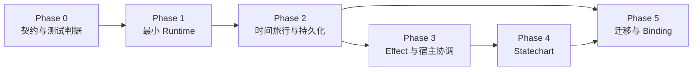

# Narrata 分步实施计划

状态：Stage 1、Stage 2 已实施；Stage 3 待实施
日期：2026-09-01

## 交付目标

计划的第一个可发布纵切不是编辑器，而是：

```text
加载已验证 Program
→ say / advance / choice / set / branch / call / return
→ 每个交互 safe point 产生不可变 Commit
→ save / load / rewind / fork
→ 可选开启完整 Timeline Archive
→ native reference store 崩溃安全
```

完整 Statechart、跨语言 Binding 和 Nickel authoring adapter 在这条纵切稳定后增加。

## 依赖顺序



- [Phase 0：契约与测试判据](./00-contracts-and-test-oracles.md)
- [Phase 1：最小确定性 Runtime](./01-runtime-kernel.md)
- [Phase 2：时间旅行与持久化](./02-time-travel-and-persistence.md)
- [Phase 3：Effect 与宿主协调](./03-effects-and-host-coordination.md)
- [Phase 4：Statechart](./04-statecharts.md)
- [Phase 5：迁移、Binding 与 Nickel 适配](./05-migrations-bindings-and-nickel.md)

## 当前 workspace（Stage 2）

先保持少量 crate，等依赖边界和编译成本提供证据后再拆：

```text
crates/
  narrata-core/          # typed IR、VM、runtime state、纯 transition
  narrata-store/         # checked object、Commit/Ref、timeline、bundle、GC、coordinator
  narrata-store-sqlite/  # native crash-safe reference adapter
  narrata-testkit/       # fixture、model、generator、conformance backend
  narrata-cli/           # validate/inspect/run/replay/conformance

fixtures/
  codec/ program/ runtime/ negative/ conformance/

fuzz/
  fuzz_targets/
```

Phase 4/5 再按实际边界增加
`narrata-statechart`、`narrata-protocol`、`narrata-ffi`、
`narrata-wasm` 和可选 `narrata-nickel`。不要在第一批 PR 创建十多个空 crate。

## 每一步的完成规则

每个编号步骤应能成为独立、可审阅的变更，并同时包含：

1. 该步需要的 public/internal contract；
2. 正常、失败和边界测试；
3. 对应 golden/model/fuzz fixture（如适用）；
4. 文档或 ADR 更新；
5. 没有使用 `unwrap`/panic 接收不可信输入；
6. 不通过 unchecked cast/assertion 恢复已丢失的类型保证。

状态或格式若尚未有证据，不先宣布稳定。`v1` wire/save 只在 cross-version fixture 和 crash
test 已存在后冻结。

## Release gate

Stage 1 的合并实施与自动 Gate 见
[Stage 1：Deterministic In-Memory Narrative Kernel](./stage-1-deterministic-kernel.md)。

| Gate | 可交付能力 | 必须通过 |
| --- | --- | --- |
| G0 | 可执行语义骨架 | 类型/codec vectors、trace schema、CI |
| G1 | 内存中运行短篇剧情 | 确定性、预算、save/restore 等价 |
| G2 | 本地持久存档、时间旅行与可选完整归档 | crash matrix、CAS、branch、Catalog、bundle、GC、corruption fuzz |
| G3 | 安全宿主 Effect | commit-before-dispatch、ledger、barrier、联合存档 |
| G4 | 层级/并行 Statechart | SCXML 子集 golden/model tests |
| G5 | C/Wasm 与升级 | binding conformance、migration corpus、旧存档 CI |

任何 Gate 的性能优化都不能先破坏前一个 Gate 的 conformance fixture。

## 明确延后

- Visual Graph editor 和完整文本 DSL；
- 任意脚本/宿主 callback；
- Rust async continuation；
- 浮点剧情分支和真实时间；
- 多个并发 external Effect；
- timeline merge、多人 CRDT；
- 云同步冲突自动合并；
- WIT Component 作为唯一 ABI；
- 在 runtime 中嵌入 Nix 或 Nickel evaluator。

## 风险最高的验证门槛

1. deterministic CBOR encoder 是否能跨 Rust/native/Wasm 保持 golden bytes；
2. 在每个 safe point 写全量 Snapshot 的延迟与存储量是否可接受；
3. SQLite/IndexedDB adapter 是否能满足 object + Ref 的原子可见性；
4. external effect 的 idempotency/unknown outcome 是否被宿主 API 真正支持；
5. Program 更新是否有足够 Stable ID 覆盖所有 frame/return/history；
6. parallel Statechart 的 transition conflict 顺序是否有无歧义 trace。

这些风险都在依赖它们的功能之前安排 spike 或模型测试，而不是留给最终集成。
