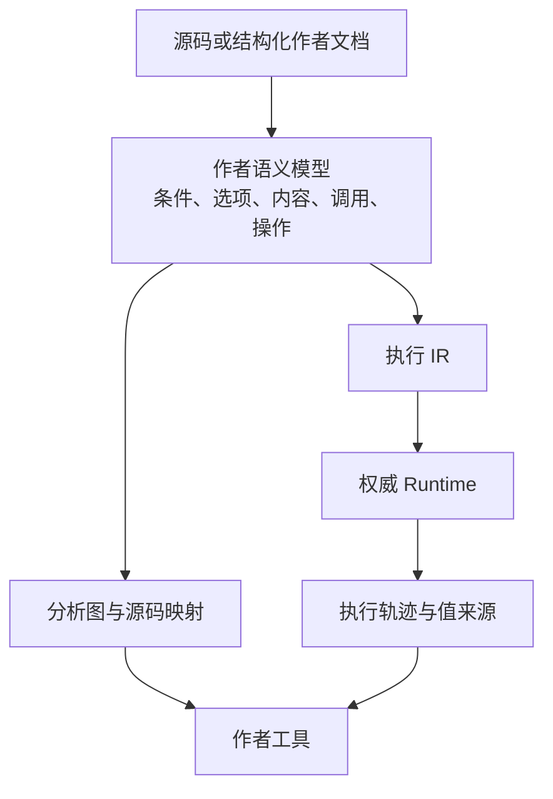

# Narrata 与竞品的架构差异及可改进方向

状态：研究与设计提案，未修改运行时实现。

后续方案：[可组合叙事引擎重建提案](../../archive/2026-09-05-rebuild-proposal.md) 进一步扩展到 Gamebook、
同伴体系与 package 组合。本页的源码观察仍是当时证据，下一步范围和抽象选择以新提案讨论为准。
日期：2026-09-05。
源码基线：`95e7af90af75d13efedf08deb009014d15a16453`。

判断：Narrata 已有实质性的设计差异，继续发展有技术与产品上的理由。它的有利方向是把叙事创作、执行、状态、历史、宿主交互和内容演进接到一致的语义模型上，再通过 UI 和媒体工作流让作者使用这些能力。当前实现并未完成这一目标；现有 IR、SceneState、表达式和存储方式都可以调整。

竞争者数量不能判定项目价值；功能能在其他引擎上扩展实现，也不能单独否定一个集成方案。应比较某种设计在目标任务上的完整性、易用性、可组合性、性能和维护成本。以下比较使用官方文档与本地源码，不将“未在文档中找到”解释为“竞品绝对无法做到”，也不将竞品公布的开发目标当作已经发布的能力。

## 1. 各项目正在优化什么

| 项目 | 设计中心与已核实能力 | 对 Narrata 的启示 |
| --- | --- | --- |
| Ink | 文本内容与流程编织；weave/gather 支持局部分支与自然汇合，tunnel/thread 支持组合；编译为较低层 container/runtime 对象 | 作者语言必须让普通写作省力；大量手动节点、标签和连线可能是退步 |
| Yarn Spinner | 节点式对白与宿主集成；已有 storylets、saliency、内容复用和编辑器；正在扩展路径求解工具 | 不能把它描述成只有线性对白；动态内容选择与作者工具也是竞争重点 |
| Ren’Py | 把脚本、展示、交互与 save/rollback 放在完整 VN 环境里 | 自动恢复画面与游戏状态是实际作品需求；语言选择本身不决定作者体验 |
| Naninovel | Unity 内的服务化 VN 系统；脚本、角色、存档等服务，自定义状态可纳入存档和回滚 | 服务分层、扩展和回滚不是 Narrata 独有；差异需落在跨宿主语义及统一契约 |
| articy:draft | 图、实体、条件与模拟旅程；能查看变量变化、高亮失败子表达式 | “画图＋解释条件”已有成熟先例，应比较真实运行与模拟是否一致、调试是否完整 |
| Narrat | Web/桌面叙事 RPG、脚本、本地化、CSS 主题、插件与开发预览 | 浏览器叙事和现代 Web 工作流不是无人覆盖；可借鉴更短的创作路径 |

来源：[Ink 写作语义](https://github.com/inkle/ink/blob/master/Documentation/WritingWithInk.md)、[Ink 架构](https://github.com/inkle/ink/blob/master/Documentation/ArchitectureAndDevOverview.md)、[Yarn storylets](https://yarnspinner.dev/docs/yarn/03-advanced/02-storylets-and-saliency-a-primer/)、[Ren’Py 存档](https://www.renpy.org/doc/html/save_load_rollback.html)、[Naninovel 架构](https://naninovel.com/guide/engine-architecture)、[Naninovel 状态](https://naninovel.com/guide/state-management)、[articy 模拟](https://www.articy.com/help/adx/Presentation_Simulation.html)、[Narrat](https://docs.narrat.dev/)。

需要修正前面讨论的两个判断：

- 条件表达式的失败原因高亮不是未被解决的问题；articy 已提供，并支持初始变量覆盖与历史变量变化检查。[模拟文档](https://www.articy.com/help/adx/Presentation_Simulation.html)
- Yarn 的 Story Solver 正在做覆盖、最短路径、任务路线和结局可达性等工具。2026-08-31 的开发更新仍给出年底发布目标，因此本次按开发中能力处理，不能说已经成熟，也不能说竞品没有这条方向。[最新相关开发更新](https://yarnspinner.dev/blog/monthly_aug_26/)

## 2. Narrata 已存在的实质差异

### 2.1 将可恢复运行历史纳入引擎协议

Narrata 的 [Commit](../../crates/narrata-store/src/commit.rs)、[coordinator](../../crates/narrata-store/src/coordinator.rs)、migration 与 timeline inspection 已有实现。状态、执行位置、Ref、分叉与迁移记录在同一套模型里。

Ink 已有完整故事状态的 JSON 保存/加载；Ren’Py 和 Naninovel 也有回滚机制。因此合理的差异表述是：Narrata 在公共模型中进一步明确历史身份、分叉关系、恢复来源与演进操作，而不是发明了保存与回滚。[Ink 运行接口](https://github.com/inkle/ink/blob/master/Documentation/RunningYourInk.md)、[Ren’Py 回滚](https://www.renpy.org/doc/html/save_load_rollback.html)

这可以支持玩家路线管理、bug 重现和内容版本调试。现阶段属于已实现基础与待完成的产品能力。当前 Commit 只有一个 parent，不能宣称支持历史合并。

### 2.2 将宿主操作的交付和回滚政策显式化

当前 [CapabilityDeclV0](../../crates/narrata-core/src/effect.rs) 同时描述请求/响应 schema、交付 policy 与 rewind policy；已有 RecordedQuery、Reconcile、幂等交付、Barrier 等机制。

Ink 的 external function 也明确区分计算和动作，通过 `lookaheadSafe` 控制前瞻执行；它并非完全不考虑副作用。[Ink 外部函数](https://github.com/inkle/ink/blob/master/Documentation/RunningYourInk.md)

Narrata 的差异在于把更多恢复和宿主协调责任纳入共享契约。宿主仍需真正实现幂等或事务能力；schema 与 policy 不能凭空保证外部系统行为。它适合一份故事跨宿主、包含持久外部状态的场景，也可能增加轻量集成的负担。

### 2.3 将 Flow 与 Statechart 纳入同一状态体系

当前 [StatechartActionV0::StartFlow](../../crates/narrata-core/src/statechart/ir.rs) 已存在；Flow 可通过 Raise 发送事件，完成时把结果和事件返回状态机。这不是两个不相关的模块名。[运行模型](../architecture/runtime-model.md)

可以直接表达“任务进入某状态后启动对白，玩家选择结束后推进任务”。但当前调用流程中的事件会被延后处理，不能把它宣传成任意多个对白实时并行运行；中断、抢占与调度仍需要明确语义。

Yarn 的 storylets/saliency 解决的是按条件选择当前合适内容，与层级状态机不同。Narrata 的 Statechart 不自动覆盖内容池、优先级、冷却、去重与访问统计等作者需求。[Yarn storylets](https://yarnspinner.dev/docs/yarn/03-advanced/02-storylets-and-saliency-a-primer/)

### 2.4 以一套 Rust 语义实现提供多种 binding

当前协议、Wasm/C ABI 和 conformance 资产为同一 Program 跨宿主提供基础。不同语言 runtime 各自实现同一规范也可以正确；Narrata 选择复用一个实现，可以减少需要维持等价的解释器数量，但需要承担 FFI、异步切片和持久化适配成本。

这项价值应以同一 corpus、跨端恢复与宿主集成结果验证，不以“使用 Rust”本身计分。Core 的确定性也不意味着所有浏览器呈现相同像素和音频采样。

## 3. 当前架构真正值得改进的地方

### 3.1 增加作者语义层，保留解释所需信息

当前 [Flow 指令](../../crates/narrata-core/src/program/instruction.rs) 面向执行，包括 Load、Store、JumpIfFalse 等。Choice 的 `visible_if` 引用布尔 slot，而 [Statechart guard](../../crates/narrata-core/src/statechart/ir.rs) 另有表达式结构。

这些选择适合小型 VM，但无法仅凭一个布尔结果完整说明“哪个作者条件为什么失败”。如果先把复杂条件降为临时变量，再要求 UI 从指令倒推作者意图，会增加调试器难度。

建议 compiler 内保留作者语义表示：对白、选项、条件、调用、内容引用、宿主操作，以及源码和稳定身份。由它同时生成执行 IR 与 analysis/debug metadata。Flow、Statechart 与将来的 selector 共用有明确纯度和类型约束的表达式定义或 lowering 规则。

Compiler 分层本身不是创新，Ink 已有 parser 与运行代码生成。可优化的是语义信息在工具链内的保留和共享，使图、测试、解释、内容引用与迁移不必各自重建一套逻辑。[Ink 架构](https://github.com/inkle/ink/blob/master/Documentation/ArchitectureAndDevOverview.md)

### 3.2 把内容身份、执行身份、呈现内容分开

当前 [SayView](../../crates/narrata-core/src/runtime/interaction.rs) 提供 InteractionId、speaker 字符串和 text 字符串；ChoiceView 主要提供可选项的 ID 与 label。现有 origin instruction 和 Source Map 能辅助定位，但尚不是完整的台词/角色/本地化内容模型。

建议引入或明确以下身份及关系：

- 一段可复用内容的身份；
- 它在剧本某个位置出现的身份；
- 本次运行出现的交互身份；
- 语言、富文本参数、配音与逻辑资源引用。

这样可支持台词复用、翻译更新、配音定位、缺资源检查与已读策略，而不用把台词文本当作唯一标识。哪些内容会影响分支、哪些只影响呈现，需要在契约中明确。

Yarn 已有 line ID 与 shadow line，允许复用文本而不复制 string table 条目；这部分 Narrata 应先补齐，再通过与稳定运行身份、版本影响分析和媒体清单的结合改进整体流程。[Yarn Shadow Lines](https://yarnspinner.dev/docs/yarn/03-advanced/06-shadow-lines/)

### 3.3 细化选择的可见性与可用性

当前 [choice 执行](../../crates/narrata-core/src/runtime/runner.rs) 会过滤不可见选项，全部过滤后产生 `NoVisibleChoices`。这适合最小执行模型，但不足以自然表达“显示一个锁定选项，并解释解锁条件”。

建议区分 `visible` 与 `enabled`，并提供有权限控制的解释数据。作品可选择隐藏、显示锁定、说明条件、或进入明确 fallback。开发者检查器可以看到更详细条件，但玩家端不应默认泄露隐藏剧情。

这首先是作者和玩家体验的补齐，不应包装成独有技术。进一步的优势是使用同一条件语义生成作者解释、测试输入和运行结果。

### 3.4 重新确定 SceneState 的位置

当前 [SceneState](../../crates/narrata-core/src/scene.rs) 包含图层、立绘坐标、相机、音频通道。这些是可用的 VN 展示抽象，但“与 Web 解耦”不等于“对所有宿主都中立”。聊天阅读器、纯文本 Gamebook 与 Unity 3D 场景并不一定需要接受同一套二维相机模型。

建议比较两种实现：

1. 保留现有 SceneState，作为可选第一方 VN 模型，让不需要它的宿主无需操作这些字段。
2. 将其演进为版本化的标准 presentation profile，由基础 Core 只处理其身份、状态和受约束交互；VN profile 提供当前场景语义。

更倾向先验证第一种，再决定是否需要第二种。通用扩展容器必须定义 schema 校验、确定性编码、迁移与资源引用，否则会丢失当前类型约束。不能为了“通用”退化成任意 JSON payload。

持续目标状态与一次性 cue 也应分别表达：背景/角色可被恢复到目标状态；一次音效、闪白或震动需要发生身份、取消和重播策略。媒体调度细节放在 profile/宿主，重要完成事件进入 Runtime 的受校验输入。

### 3.5 把反事实调试和测试做成同一条路径

已有 Commit、Snapshot 和 replay 基础，可以进一步提供以下操作：

“从这个 checkpoint 出发，在隔离测试分支把某输入改为另一选择，使用显式的 Effect 测试响应，重跑到指定位置，比较结果，并保存为回归测试。”

普通试玩、反事实试验、真实历史和迁移验证都携带精确 Program/Commit 身份。测试状态修改必须作为显式测试构造记录，不能伪装成玩家真实历史；外部操作默认使用受约束测试宿主。

这项产品价值来自集成。articy 已有变量覆盖和旅程调试，Yarn 正在做求解工具；Narrata 可以追求从检查到复现、修复、保存测试的连续工作流。[articy 模拟](https://www.articy.com/help/adx/Presentation_Simulation.html)、[Yarn 开发进展](https://yarnspinner.dev/blog/monthly_aug_26/)

静态分析和动态测试必须说明证明范围。可以输出“结构不可达”“在给定初始状态和预算内找到路径”“因宿主结果未知而未判定”；遇到无限循环、递归或未建模宿主行为不能承诺枚举全部路线。

### 3.6 按需求加入内容选择策略

若要覆盖环境对白、任务提示和动态世界叙事，建议在 Flow 与 Statechart 之上验证一个轻量内容选择器：候选条件、优先级、访问次数/冷却与确定的 tie-break。

先通过现有能力编译表达，出现必要性后再加入独立 IR。若使用随机选择，随机种子/状态或抽样输入必须可重放。第一版可用稳定顺序消除随机依赖。

它与 Yarn saliency 同类，不能被称为原创；它的意义在于 Narrata 用同一执行/存档/调试规则覆盖顺序剧情与按条件选择内容，作者不必用大量胶水代码连接两套系统。[Yarn saliency 原理](https://yarnspinner.dev/docs/yarn/03-advanced/02-storylets-and-saliency-a-primer/)

## 4. 存储和性能可以改，先保留语义再比较实现

当前 [coordinator](../../crates/narrata-store/src/coordinator.rs) 在提交时导出完整 Snapshot；[export_snapshot](../../crates/narrata-core/src/snapshot/export.rs) 编码完整状态。[CheckedProgram](../../crates/narrata-core/src/program/checked.rs) 通过 ID 索引查找指令。这些是已核实的实现形状，本次没有 benchmark，不能据此宣布性能差。

若基准显示成本显著，可比较：

- 内部将稳定 ID 解析为紧凑执行地址，外部仍保留持久身份与双向映射；
- 内存状态使用结构共享，减少重复复制；
- 物理存储采用分块去重、压缩或带检查点的增量表示，同时保留可验证的完整逻辑状态；
- 历史按交互或章节聚合展示，持久化按公开的保留策略管理；
- 分别提供简单会话入口与高级历史/宿主协调入口。Core/Store 已经分离，应改进默认 API 和打包，不需要再重复拆分。

物理增量表示必须验证恢复链、完整性、GC closure 和崩溃恢复。指令优化不得越过可观察 safe point、改变 Effect 次数或丢失可恢复 continuation。语义不变的优化与需要新格式/迁移的变更应分别处理。

## 5. 图与文本的权威来源仍是可调整的选型

上一份路线图倾向文本源码为权威，是为了降低首版复杂度。它不应成为永久限制。

如果目标作者主要编写长篇正文，源码加保留格式的语法树编辑更合适；如果目标主要是可视化管理与组合，结构化作者文档加文本投影也值得比较。两者都需要稳定身份、可审阅 diff、注释保留、撤销和版本冲突处理。

真正应避免的是两份互相漂移的剧情真相。图文无损互转只对明确支持的语义子集承诺；不能为任意宿主脚本承诺自动反向生成可编辑图。

## 6. 更有针对性的下一步

建议用三个小型实现来选择架构，而不是先把现有模型冻结再把 UI 套上去：

| 优先级 | 实现与对照 | 要获得的证据 |
| --- | --- | --- |
| P0 | 一个作者场景同时生成执行 IR、结构图和条件解释；包含局部分支/汇合 | 作者模型能否支撑易写、可视化与可信调试；与 Ink/Yarn 的基本写作量比较 |
| P0 | 同一个已提交状态分叉试验、对比变量/内容、导出回归测试 | 历史模型能否直接减少调试步骤；外部 Effect 是否被正确隔离 |
| P1 | 同一段有角色、内容 ID、锁定选项、语音引用的剧情接纯文本与 Web VN 宿主 | 哪些应留在通用叙事契约，哪些应属于可选 presentation profile |
| P1 | 相同语义和数据规模下测试完整快照及替代表示 | 真实 CPU、内存、持久化量、恢复耗时与复杂度，而非仅比较理论速度 |

完成这些实验后，可以保留现有架构的大部分，也可以调整 IR、Scene 分层与协议。既有 fixture 用来明确语义变化和兼容边界，不应成为拒绝改进的理由；格式改变需要版本与迁移说明。

Narrata 已有的区别足以支持继续做产品化设计。最值得追求的方向是：作者用一种容易表达故事的模型，同时得到可靠执行、可解释状态、可管理历史和可演进内容，再由第一方 Web 媒体工具链交付作品。没有必要要求某一单项功能全球唯一；需要让这个组合在真实使用中完整、顺畅，并且足够容易集成。
