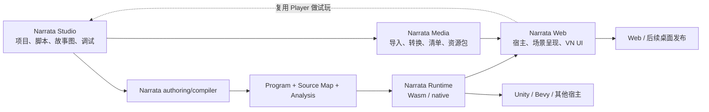

# Narrata 工具链路线：从叙事核心到作者工作台与 Web VN

状态：提案，未实施，也不替代已有 ADR。

后续方向已调整：下一步优先级以 [可组合叙事引擎重建提案](../../archive/2026-09-05-rebuild-proposal.md) 为准。
本页保留为作者工具与媒体工作流研究，不再建议直接启动 Stage 6；其中 Scene/Flow 假设需按新提案复查。
调研日期：2026-09-05。
仓库基线：`95e7af90af75d13efedf08deb009014d15a16453`。

后续补充：[竞品架构比较与候选优化](./2026-09-05-narrata-competitive-architecture.md)。本路线图中的文本权威模式、Scene 边界和实现顺序均是可调整的提案；开始实施前结合该比较确认作者模型与真实差异。

建议将下一阶段定义为 **Stage 6：Authoring Contract 与 Studio 作者闭环**。目标是让作者完成“建项目、写故事、看分支、试玩、检查状态、回滚分叉、保存并恢复”，随后以同一套运行语义接入基础媒体与 Web 发布。Narrata 的产品定位是开源、跨引擎的叙事引擎；确定性运行时、时间线与迁移构成它的技术基础。

本方案结合用户提供的项目价值对话、当前源码与官方网络资料。竞品能力属于文档核实；技术选择、阶段划分和验收目标属于本方案建议。未运行全套 G5，也未审计最新远程 CI 结果；不能把旧对话里的 CI 失败次数当成当前事实。

## 1. 当前到底缺什么

| 当前证据 | 已有基础 | 下一步缺口 |
| --- | --- | --- |
| [实施总览](../../archive/plan/README.md) | Stage 1–5 文档及对应 workspace；完整 DSL、Visual Graph editor 明确延后 | 建立作者能实际使用的入口 |
| [指令模型](../../crates/narrata-core/src/program/instruction.rs) | Say、Choice、条件跳转、Call/Return、Effect、ReconcileScene | 编译器将作者语言降级到这些指令 |
| [authoring.rs](../../crates/narrata-core/src/authoring.rs) | Stable ID 分类、SourceMapSidecar、重复 ID 检查、迁移定位建议 | 持久化作者项目、ID 编辑生命周期、编译与源码编辑协议 |
| [program inspect](../../crates/narrata-cli/src/commands/inspect.rs) | 构件身份、flow/指令数量等摘要 | 面向 UI 的节点、边、源码范围、条件与引用信息 |
| [Core debugger](../../crates/narrata-core/src/debugger.rs) / [Store debugger](../../crates/narrata-store/src/debugger.rs) | 变量、frame、活动 state 检查；Commit/Ref/coverage 检查 | 将这些能力通过版本化协议提供给浏览器 |
| [narrata.proto](../../crates/narrata-protocol/proto/narrata.proto) | 加载、dispatch、切片执行、checkpoint/archive 导入导出 | 没有专用 runtime/timeline inspect、rewind、fork、migration dry-run 请求；也没有完整的 typed Scene 展示 DTO |
| [SceneState](../../crates/narrata-core/src/scene.rs) | 图层、角色、相机、音频通道、交互目标；资源引用为 EntityId | 明确媒体资源解析、展示能力与恢复策略 |
| [TypeScript binding](../../bindings/typescript/README.md) | 生成 DTO、Wasm 包装、IndexedDB Store | 验证浏览器会话到持久化 Store 的完整接线与恢复流程 |

这意味着“有 Wasm binding”尚不能等同于“浏览器已经有完整的叙事调试器”。应复用 Rust 内部能力，补公开边界；前端不自行解码私有 Snapshot 或重写 VM。

[当前 CI](../../.github/workflows/ci.yml) 包含 workspace Rust 测试与 WASI conformance，但没有完整执行 [G5 脚本](../../scripts/check-g5.ps1) 中的 .NET、TypeScript 等步骤。G5 的部分 Unity 检查本身是静态检查，浏览器目标检查也不能替代真实浏览器交互验证。Stage 6 应补齐与作者闭环相关的 CI 和浏览器测试，保留已有兼容性检查。

## 2. 网络调研给出的产品依据

| 参照对象 | 官方资料确认的能力 | Narrata 应吸收的做法 |
| --- | --- | --- |
| [Inky](https://github.com/inkle/inky) | 边写边编译试玩、错误定位、多文件项目、跳转到定义、编译后尝试重走已选路线 | 把写作、反馈、定位放在同一工作区；降低作者接触运行时细节的频率 |
| [Yarn Spinner Editor](https://yarnspinner.dev/docs/yarn-spinner-editor/) | 交互图、节点整理与颜色、实时试玩、类型信息、导航、导出 | “脚本＋分支图＋试玩”已是竞争基础；第一版必须形成联动 |
| [Yarn 试玩工具](https://yarnspinner.dev/docs/yarn-spinner-editor/02-previewing-your-dialogue/) | 切换起始节点、查看变量与不可用选项、导出独立 HTML 试玩 | 让作者可以在完整游戏集成之前验证剧情 |
| [Arcweave](https://docs.arcweave.com/introduction/quick-tour/share-export) | 图表、组件、变量、分享试玩与引擎导出；[导出模型](https://docs.arcweave.com/project-tools/export)区分 boards、elements、connections 和组件 | 叙事管理需要章节/场景/人物/变量/引用与导出，不能只有画布 |
| [Twine](https://twinery.org/) | 官方将编辑器与决定运行能力、写法的 story format 区分 | 作者工具与运行层可以分离；Narrata 系列仍应共享一致的核心语义 |
| [Narrat](https://docs.narrat.dev/) | Web/桌面目标、易用脚本、本地化、CSS 主题、项目创建与开发预览 | Web 路线已有成熟参与者，需要以完整作者流程和运行时能力建立价值 |
| [Monogatari](https://monogatari.io/v2/configuration-options/game-configuration/asset-preloading) | 资源预加载配置；[项目结构](https://monogatari.io/v2/getting-started/step-3-get-familiarized)区分故事、资源、样式与引擎 | 资源组织、预加载和主题需要成为第一方工作流 |
| [Ren’Py Web 文档](https://www.renpy.org/doc/html/web.html) | 已支持 WebAssembly/Web 发布，同时记录浏览器媒体、线程等限制 | 用实际首屏、媒体、存档与跨浏览器测试比较成果；不能把换语言当成完整 VN 体验的证明 |

由这些资料推导，本方案建议 Narrata 优先形成两类价值：普通作者获得短路径的创作体验；复杂作品获得可见的运行历史、状态解释、可靠回滚和内容升级后的存档处理。这是待作品验证的产品假设，不是已经证实的市场优势。

## 3. 系列仓库的职责

以下名称为建议名称，并未创建这些仓库。

| 仓库 | 负责什么 | 主要输出 |
| --- | --- | --- |
| `narrata`（当前） | Runtime、IR、Store、身份与迁移；作者语义、compiler/analyzer；协议、binding 与一致性验证 | Rust crates、Wasm/TS binding、CLI、Program、Source Map、Analysis Graph |
| `narrata-studio` | 项目与叙事管理、文本编辑、故事图、试玩调试、版本影响 UI；后续可视化媒体编辑 | 桌面浏览器作者工作台，必要时再增加桌面壳 |
| `narrata-web` | 第一方浏览器宿主、资源调度、Scene 呈现、VN UI、输入、存档 UI、主题与发布模板 | 可嵌入 Player、默认 VN 模板、静态站点构建 |
| `narrata-media` | 导入、探测、转换、变体、预加载分组、依赖清单、打包与构建缓存 | Media Manifest、媒体文件及构建 CLI |

Compiler 放在当前仓库，因为它决定作者语义如何成为可执行 Program。具体网页布局和画布属于 Studio；编译器不依赖 React Flow，Core 不依赖 DOM、CSS 或浏览器媒体对象。



所有 repo 通过已发布包、版本化格式与 fixtures 集成。不要让 Studio 直接依赖 Rust 内部结构；不要为每个前端各实现一套 compiler 或 runtime。最初不必再拆出独立“共享协议仓库”，按所有权将协议留在当前 repo，将媒体格式留在 media repo。

## 4. 分支树应该怎样表达

至少要在数据模型上区分以下四种视图，第一版优先交付故事结构图与运行时间线。路线展开和完整 Statechart UI 可以后续加入。

| 视图 | 回答的问题 | 正确的数据模型 |
| --- | --- | --- |
| 故事结构图 Program Map | 这一章有哪些场景？条件、选项、调用与跳转怎样连接？ | 可有汇合、循环和多重边的有向图；不是固定的树，也不保证是 DAG |
| 路线展开 Route Projection | 从某个入口和测试状态出发，可能走哪些路线？ | 有深度/数量/时间预算的派生树；标出循环、截断与未知 |
| 运行时间线 Runtime Timeline | 这次试玩实际发生了什么？从哪里回滚并走了另一条路？ | Commit、Ref、游标与历史覆盖范围 |
| 状态机图 Statechart View | 任务/世界状态如何随事件变化？哪些区域并行活动？ | 状态层级、区域与 transition；不与对白顺序图混用 |

当前 [CommitV1](../../crates/narrata-store/src/commit.rs) 只有一个可选 parent，因此实际历史是单父分叉结构，是 DAG 的受限形式；不能画出或承诺尚未实现的多父 timeline merge。故事中的两条路线汇入同一场景，也不意味着两个不同玩家状态的 Commit 被合并。

故事图默认以章节、作者场景或 Flow 聚合；进入场景后查看选择与内部流程。句子、算术运算、Load/Store 等指令不应默认各占一个画布节点。作者场景是源码组织单元，与 Core 的展示 SceneState 是不同概念。

图上支持搜索、折叠、定位引用、条件标签、当前执行位置和已有试玩覆盖高亮。点节点定位源码，点诊断定位源码和图；有条件边显示关联表达式及其源码范围。

必须诚实表达分析的范围：结构连通不证明条件可满足；一次试玩覆盖不证明所有路线可达。结构分析可以证明部分断链、缺目标和结构不可达；依赖变量组合或宿主结果的判断可能只能显示“未知”。路线展开不得通过真正调用外部 Effect 来探路。

同一源码场景可能在循环中运行多次；图上的静态节点身份与时间线上的执行 occurrence 分开。界面联动通过 Stable ID、ProgramArtifactId、CommitId 完成，不能只用节点标题。

## 5. 当前仓库应建立的作者接口

### 5.1 一条可维护的源码路径

建议第一版采用“文本源码为权威、图为派生视图”，配合章节/变量等结构化表单。持久化的语义源码只有一份；不要同时让脚本文件和 React Flow JSON 各自保存不同的剧情逻辑。

作者语言先覆盖：场景/Flow、对白、选项、布尔和整数变量、条件、跳转、调用/返回、结束。采用现有 Runtime 的类型和能力边界；暂不加入任意 JavaScript、Python 或宿主 callback。

实现初期可以用结构化 authoring fixtures 验证 lowering，但 Stage 6 的作者验收不能要求手填 IR、CBOR 或十六进制 ID。小型文本前端也必须在本阶段完成。Ink/Yarn 导入器可以后续增加；应列出支持子集与无法转换的语义，不把完整兼容当作启动条件。

文本包含由工具持久化的显式 anchor，编辑器可折叠或隐藏其显示。创建时分配 ID，移动和改名保留，复制产生新 ID，删除后不按名称自动复用。只改变行号不能改变 continuation 身份。编译产生的内部 ID 必须有稳定的来源规则；不能每次随机生成所有指令 ID。

将现有 SourceMapSidecar 用作编译输出与导航数据，不把“重新生成 source map”当成持久身份管理。相似文本匹配只生成迁移建议，沿用 [已有迁移边界](../architecture/program-versioning-and-migration.md)。

### 5.2 编译与分析输出

以下文件名、命令和 schema 名称均为设计建议，不表示已经存在或已经冻结。

```text
project/
  narrata.project.json        项目身份、入口、语言、格式版本
  story/                     源码及持久 anchor
  cast/                      人物与显示元数据
  locales/                   文本资源与翻译状态
  media.sources.json         逻辑资源登记（后续由媒体工具管理）
  .narrata/layout.json        图的位置、颜色、折叠等作者 UI 数据
  build/
    story.nar                canonical Program
    story.nar.map.json       源码映射
    story.nar.analysis.json  版本化作者分析结果
    story.nar.strings.json   文本/本地化导出（相应契约实现后）
```

Compiler/analyzer 建议提供：`compile`、`analyze`、`validate`、`inspect`。CLI 与 Wasm 都使用同一实现。可先增加一个 `narrata-authoring` crate 容纳 parser、lowering 和 analysis；有实际独立依赖后再拆 compiler/analysis crates。

分析格式工作名可用 `AnalysisGraphV1`，但在 fixtures 和跨版本读取检查完成前仍是 alpha 提案。至少包含：

- schema 版本、精确 ProgramArtifactId、源码/构建 revision；
- 作者节点 ID、聚合层级、关联 Flow/Instruction anchors、标题和源码位置；
- 类型明确的边：next、choice、condition、jump、call 等，以及对应目标；return 需要保留调用上下文或明确为概括性边；
- 变量与角色引用、资源引用、诊断、分析方式和不完整原因；
- 对没有作者信息的旧 Program，允许退化为指令级视图，不伪造章节结构。

静态 graph 不存“当前已访问”“当前可选”等 session 数据。UI 将 runtime inspection/trace 叠加其上。不同 ProgramArtifactId 的 analysis 与 session 不得静默混用。

布局、颜色、选中状态、诊断和源码行号不进入 ProgramArtifactId。稳定节点 ID 不变也不代表构件 ID 不变：例如当前 Say 使用的常量文本发生变化，会影响 Program 构件；身份稳定只帮助导航和迁移。未来抽取本地化文本时，必须显式区分会影响分支的内容与纯展示内容。

### 5.3 浏览器调试协议

复用现有 Core/Store 方法，在协议边界补出以下能力：

| 建议能力 | UI 用途 | 约束 |
| --- | --- | --- |
| inspect runtime | 当前源码、变量、frame、活动状态 | 携带 session/commit/program 身份；保留脱敏策略 |
| inspect timeline | 历史、分支、游标、书签 | 带 coverage；部分历史必须标为部分，不能冒充完整归档 |
| rewind / fork | 回到旧点并尝试另一条选择 | 走 Store/coordinator，保留 barrier 和幂等规则 |
| inspect scene | 当前图层、角色、音频与交互 | 输出受校验的展示 DTO，不要求 JS 解码 Rust 私有布局 |
| choice explanation | “为什么这个选项不可用” | 来自同一语义求值过程与源码映射；MVP 可只支持简单条件 |
| migration inspect / dry-run | 改剧本后的会话影响 | 先报告精确构件间变化，再显式执行迁移 |

为这些接口生成 TypeScript DTO，校验版本、ID、引用和 session 所属关系。Protobuf/JSON 结构能够解码，不等于对象在领域上有效；不能用 TS 类型断言补齐未证明的保证。

时间线检查的当前实现会遍历 Store 对象。MVP 可以复用，但协议应带分页/上限；真实长时间线出现性能证据后再改索引与查询路径。

## 6. Studio 第一版的实际作者流程

建议做一个桌面尺寸优先的 Web 工作台：左侧项目/章节/人物/变量，中央故事图与文本切换，右侧试玩及检查器，下方问题列表或时间线。通过选择联动减少反复导航；不用在首屏同时铺满所有面板。

1. 从模板创建一个故事项目，看到入口场景。
2. 在文本和简单表单里新增场景、对白、选项、变量；有自动保存和明确的导出备份。
3. 编译后立即看到结构图，点击场景进入源码，点击错误跳到对应位置。
4. 试玩真实 Wasm Runtime；选择后看到变量变化和执行位置。
5. 回到前一个 safe point，改选另一条路，时间线保留两个分支。
6. 刷新浏览器后载入 checkpoint；完整归档在明确启用后保留，并显示覆盖范围。
7. 修改剧情后显示当前会话所用构件与新构件；选择重开、重放输入或按已有映射迁移。
8. 导出可复现的试玩数据，并为下一阶段的 Web Player 复用同一运行层。

热更新要区分两件事：开发时重放已记录输入，是新的一次验证运行；将旧存档迁移到新 Program，是显式兼容性操作。重放遇到已失效 choice、不同 Effect 请求或条件变化就停下并说明，不能宣称任意改脚本后总能无损接着玩。

第一版图主要做查看、整理和定位。新增/改名等管理动作通过作者模型或受校验的源码编辑完成；任意拖线改写复杂脚本、无损双向图文编辑作为后续能力。该范围仍必须支持真正的项目编辑，不以只读可视化代替整个 Stage 6。

### UI 技术建议

- React + TypeScript + Vite 作为作者 SPA；运行时与布局计算分别放 Worker，避免编译或布局阻塞输入。
- [React Flow](https://reactflow.dev/learn/layouting/layouting) 负责交互图；它本身不提供自动布局。复杂跨组边、端口和层级布局优先验证 ELK；简单平面图可用 Dagre。
- [ELK.js](https://github.com/kieler/elkjs) 支持 Worker。默认手动整理保持稳定，自动整理按操作触发；不要每次输入都重新摆放整个图。
- [Monaco](https://github.com/microsoft/monaco-editor) 用于桌面浏览器文本编辑；官方明确不支持移动浏览器。播放器需要适配手机，Studio 的移动编辑另立目标。
- 浏览器存储需要项目导入/导出兜底；[OPFS](https://developer.mozilla.org/en-US/docs/Web/API/File_System_API) 是站点私有文件空间，不等同于用户磁盘中的 Git 工作目录。后续有直接本地文件/大型资源处理需求，再增加桌面壳或本地 companion。

性能先用代表性语料测量：例如全项目 1,000 个作者节点、当前章节展示 100–200 个节点。将编译、布局与渲染耗时分开记录，先控制显示范围，再决定进一步优化；这些规模是建议测试集，不是已验证的性能承诺。

## 7. 媒体管线与 Web Player 怎么接

媒体在作者闭环后立刻进入小样验证；完整转码与发布管线分阶段增加。无需等完整媒体编辑器完成，便可用手写小型 manifest 和少量现成资源验证场景展示与回滚。

### 7.1 区分构建管线与播放运行时

`narrata-media` 处理素材到可发布资源的转换；`narrata-web` 处理加载、解码、呈现、输入和音视频调度。将二者区分，可以让将来的编辑器调用同一媒体 CLI，而播放器只携带需要的运行依赖。

```text
原始素材
  → 导入/格式探测/元数据与来源登记
  → 逻辑资源身份
  → 图片尺寸与格式变体、音视频转换、缩略图
  → 内容摘要、依赖、章节预加载组
  → Media Manifest + 可缓存资源文件
  → Web Player 按设备能力与预算选择变体
```

图片处理先评估 [sharp](https://sharp.pixelplumbing.com/)；音视频转换先使用 [FFmpeg](https://ffmpeg.org/ffmpeg.html)。这些工具应在本地或 CI 构建时运行；浏览器端媒体编辑有真实需求时再增加相应实现。Narrata Media 的工作重点是统一资源身份、转换规则与可重建产物。

Manifest 至少记录逻辑 ID、资源 kind、可用 variants、内容 hash、字节数、尺寸/时长、语言、预加载组和回退项。构建缓存记录源文件摘要、工具版本、转换参数与实际输出摘要；不能假定所有硬件编码后都产生逐字节一致的结果。

当前 Core 资源引用是 EntityId。首版可以以它作为 manifest 索引，提供作者可读别名；如需独立 AssetId，应通过明确的类型/格式演进引入，不能直接假装已有该类型。场景加载不要求 Core 知道 URL、文件扩展名或 CDN。

人物/台词/翻译/语音的关联应使用持久内容身份。不要按行号关联配音，也不要按译文 hash 当作台词永久身份。本地化管理第一版只需支持提取、导入与缺失检测；完整翻译/录音管理可放后续 Studio。

### 7.2 浏览器呈现的初始选择

| 能力 | 建议第一版 | 后续扩展触发条件 |
| --- | --- | --- |
| 台词、选项、菜单、历史、无障碍 | DOM/CSS，键盘与触屏输入 | 复杂主题、竖排/ruby 等专门文本能力按作品需求验证 |
| 背景、立绘、层叠 | DOM 图片与 CSS transform | 实际图层量或特效需求超出预算，再引入 Canvas/WebGL |
| 常规转场 | CSS / Web Animations | 增加 shaders 或复杂合成时评估 GPU renderer |
| BGM、语音、音效 | HTMLMediaElement 与 Web Audio 按用途组合 | 精细同步、混音、ducking 等逐步扩展 |
| 普通视频 | 原生 video 元素 | 帧级剪辑、合成或导出时引入 WebCodecs |
| 存档 | Narrata 存储协议与 IndexedDB 接线，另提供文件导出 | 后续增加有明确冲突策略的同步服务 |

[WebCodecs](https://developer.mozilla.org/en-US/docs/Web/API/WebCodecs_API) 面向低层帧处理，容器读写还需要 mux/demux 工具；普通 VN 视频不必先搭这层。[WebGPU](https://developer.mozilla.org/en-US/docs/Web/API/WebGPU_API) 文档仍标记兼容性限制，应作为可选增强，播放器基础路径独立可用。

### 7.3 语义恢复与视觉恢复

Core 确定性保证剧情状态、选择和效果语义；不承诺所有浏览器渲染相同像素、相同音频采样点。

回滚后，Player 将画面恢复到目标 SceneState，取消旧过渡和过时的异步资源任务。音频采用声明的 restart/seek/best-effort 策略：例如 BGM 继续或 seek，当前语音按作品规则重播，一次性音效不会因为 UI 重绘而重复播放。

保持性场景目标与一次性播放 cue 要分开。一次性 cue 的身份关联交互/Effect 和恢复策略；加载成功、动画结束等浏览器事件也不能直接绕过 Runtime 修改剧情。如果确实影响推进，以受校验的宿主输入进入同一运行协议。

这里复用 [Effect 与宿主状态](../architecture/effects-and-host-state.md) 的既有语义，不把每一帧动画记录成剧情 Commit。

### 7.4 发布与离线

Web 发布清单固定 ProgramArtifactId、媒体 manifest 身份、Player 版本和格式兼容范围。Program 的语义身份与媒体包身份分别管理；如果资源/内容会影响 guard、Effect payload 或固定的内容依赖，则仍遵循现有 ContentLock 规则，不能一概宣称“换任何资源都不影响构件”。

先发布普通静态 Web 包。随后加入章节预加载、缓存校验、可选离线包和版本切换；避免一次下载所有路线的全部资源，也避免新版脚本配旧媒体的混合缓存。

浏览器音频启动受[自动播放规则](https://developer.mozilla.org/en-US/docs/Web/Media/Guides/Autoplay)影响，默认以开始游戏等用户手势初始化，并处理拒绝播放。浏览器存储有[配额与驱逐机制](https://developer.mozilla.org/en-US/docs/Web/API/Storage_API/Storage_quotas_and_eviction_criteria)，应提供存档导出、空间检测和缓存失败处理。离线作品只能承诺已下载的资源可用，不能把 PWA 安装当作永久保存保证。

## 8. 实施顺序与可验收成果

| 批次 | 当前 repo 工作 | 系列其他 repo 工作 | 完成证据 |
| --- | --- | --- | --- |
| 6.0 作者契约 | 新 ADR、项目与 Stable ID 生命周期、analysis/debug 格式草案；补作者链路依赖的 G5 检查 | 用样例确定界面所需数据 | 一个包含分支、汇合、循环、调用的样例，准确列出图/源码/runtime 的映射 |
| 6.1 看见现有 Program | 从 checked IR + 已有 Source Map 导出 analysis；CLI 输出 | Studio 最小 viewer：导入、看图、点节点定位、初步试玩 | 现有 fixture 能生成可解释图；旧 Program 无源码时诚实降级 |
| 6.2 能写故事 | 最小作者语言/parser/lowering、持久 anchors、诊断与 Wasm 编译入口 | 文本与项目编辑、编译反馈、真实 Runtime 预览 | 新建项目后无需 Rust/IR 知识，写出有条件分支的短故事 |
| 6.3 能调试与恢复 | inspect/rewind/fork/scene 等协议；生成 binding；持久会话接线；最小迁移 dry-run | 时间线、变量/条件检查、回滚分叉、存档恢复、版本影响提示 | 浏览器刷新后恢复；从旧点分叉保留历史；一次明确的 v1→v2 存档迁移演示 |
| 7.0 媒体小样 | 校正 Scene/capability 契约中的实际缺口 | Web Player：背景、两位角色、BGM、语音、基础转场；小型 manifest | 加入媒体后选择与回滚语义仍一致，画面和声音可恢复 |
| 7.1 媒体构建 | 保持公共协议兼容 | Media CLI：探测、转换、变体、校验、章节资源组 | 一套原始素材能稳定构建、发现缺资源，并输出可播放媒体包 |
| 8 Web VN 发布 | 维护格式、迁移与 conformance | 发布模板、主题、文本体验、已读/跳过/自动、存档 UI、本地化、离线与桌面封装 | 一部实际短篇作品完成制作、分发、更新与旧存档恢复 |

批次表示依赖与交付顺序，不是对团队工期的承诺。6.1 的 viewer 可以尽早给出可见成果；6.0 不应扩张成“设计整个系列之后才写第一个页面”。基础媒体小样可在 6.3 后立即开始，按需要验证协议再反向修正。

**当前最值得开的首个实现 PR：作者与分析契约＋现有 Program 的分析导出。** 它至少应包含 ADR、分支/汇合/循环/调用 fixtures、Stable ID 与聚合映射规则、一个可由外部 UI 读取的版本化 analysis 输出，并为后续协议扩展列出明确的请求/响应。这个 PR 完成后，Studio 即可开始使用真实数据。

### Stage 6 验收样例

制作一部约 10–15 分钟的短篇作为建议验收语料：3 个章节、约 20 个作者场景、至少 2 个结局、1 个条件选项、1 次汇合、1 个循环、1 次 Flow 调用、1 个受控宿主 Effect。数量服务于覆盖场景，不是产品硬限制。

验收需要证明：

1. 作者从模板完成创建、编辑、保存、看图与试玩，错误能定位源码。
2. 作者能解释一个选项为何不可用；无法静态判定的路线标为未知。
3. 保存/刷新/载入后在同一 committed safe point 继续。
4. 回滚与分叉不覆盖旧 Commit，不越过不允许的 barrier，不重复业务 Effect。
5. 改名/移动源码保留 Stable ID；布局修改不改变 ProgramArtifactId。
6. 分别测试源码无语义修改、影响 Program 的修改、删除 continuation 三种更新；后一种无映射时明确失败，有映射时 dry-run 后迁移。
7. Studio 的预览与 CLI 在同一 Program/输入下给出相同语义结果；至少加入真实浏览器链路验证。
8. 媒体小样接入后验证加载失败、快速跳过、回滚、语音重播及背景切换取消；手机 Player 和桌面 Studio 分别验收。

在此闭环成立前，完整无损图文互转、多人协作、自动 timeline merge、任意宿主脚本、完整 Statechart 可视化、全媒体时间轴和更多 binding 均不进入首批范围。它们按真实作品的瓶颈排序。

首阶段的交付标准是：作者能在 UI 中管理并完成一个可运行故事；随后同一个故事接入媒体并发布到 Web。这样每批工作都直接推进 Narrata 系列最终的 VN 解决方案。
